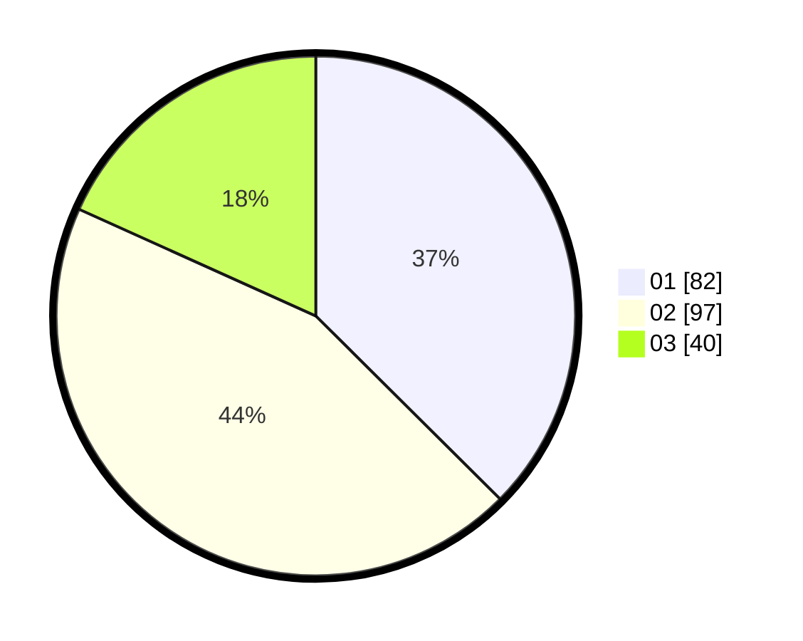

# Hasil

Hasil perolehan suara paslon dapat dilihat pada file paslon-01.txt, paslon-02.txt, dan paslon-03.txt.

Jika tidak ada, artinya data tersebut belum ada pada SIREKAP.

## Perolehan Suara

 * Paslon 01: **82**.
 * Paslon 02: **97**.
 * Paslon 03: **40**.

## Foto C Plano

https://sirekap-obj-formc.kpu.go.id/b03c/pemilu/ppwp/31/73/01/10/02/3173011002097-20240216-145319--410f3f30-c842-42b2-a8a5-ac143f07324a.jpg

https://sirekap-obj-formc.kpu.go.id/b03c/pemilu/ppwp/31/73/01/10/02/3173011002097-20240216-145320--e5027a69-e08e-429e-b373-a98a94299779.jpg

https://sirekap-obj-formc.kpu.go.id/b03c/pemilu/ppwp/31/73/01/10/02/3173011002097-20240216-145320--55c6aecf-7769-483e-97f9-f4429d90519e.jpg

## DATA PEMILIH TETAP

Jumlah pemilih dalam DPT: **278**.
 * L: **137**.
 * P: **141**.

## DATA PENGGUNA HAK PILIH

Jumlah pengguna hak pilih dalam DPT: **217**.
 * L: **109**.
 * P: **108**.

Jumlah pengguna hak pilih dalam DPTb: **7**.
 * L: **4**.
 * P: **3**.

Jumlah pengguna hak pilih dalam DPK: **0**.
 * L: **0**.
 * P: **0**.

Jumlah pengguna hak pilih: **224**.
 * L: **113**.
 * P: **111**.

## JUMLAH SUARA SAH DAN TIDAK SAH

JUMLAH SELURUH SUARA SAH: **219**.

JUMLAH SUARA TIDAK SAH: **5**.

JUMLAH SELURUH SUARA SAH DAN SUARA TIDAK SAH: **224**.
