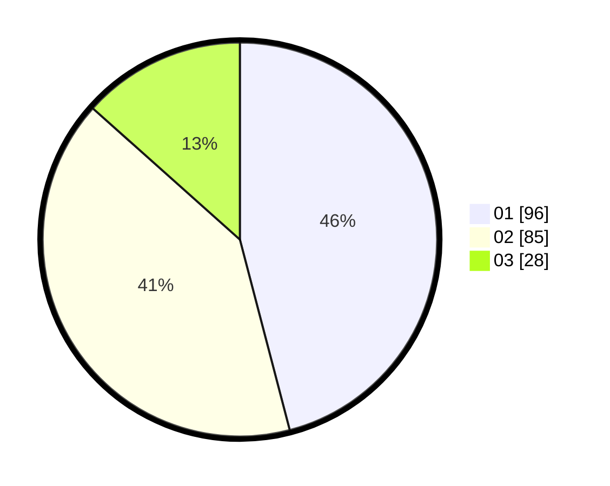

# Hasil

Hasil perolehan suara paslon dapat dilihat pada file paslon-01.txt, paslon-02.txt, dan paslon-03.txt.

Jika tidak ada, artinya data tersebut belum ada pada SIREKAP.

## Perolehan Suara

 * Paslon 01: **96**.
 * Paslon 02: **85**.
 * Paslon 03: **28**.

## Foto C Plano

https://sirekap-obj-formc.kpu.go.id/721b/pemilu/ppwp/31/73/01/10/02/3173011002098-20240216-081226--4ea2ad0a-ea46-454a-adde-2d7561420794.jpg

https://sirekap-obj-formc.kpu.go.id/721b/pemilu/ppwp/31/73/01/10/02/3173011002098-20240216-081227--d6855969-5835-45ed-a8fd-8417545b0414.jpg

https://sirekap-obj-formc.kpu.go.id/721b/pemilu/ppwp/31/73/01/10/02/3173011002098-20240214-160107--f37bc82c-9402-43a3-a233-ccb4c836a24e.jpg

## DATA PEMILIH TETAP

Jumlah pemilih dalam DPT: **277**.
 * L: **139**.
 * P: **138**.

## DATA PENGGUNA HAK PILIH

Jumlah pengguna hak pilih dalam DPT: **211**.
 * L: **105**.
 * P: **106**.

Jumlah pengguna hak pilih dalam DPTb: **0**.
 * L: **0**.
 * P: **0**.

Jumlah pengguna hak pilih dalam DPK: **3**.
 * L: **1**.
 * P: **2**.

Jumlah pengguna hak pilih: **214**.
 * L: **106**.
 * P: **108**.

## JUMLAH SUARA SAH DAN TIDAK SAH

JUMLAH SELURUH SUARA SAH: **209**.

JUMLAH SUARA TIDAK SAH: **4**.

JUMLAH SELURUH SUARA SAH DAN SUARA TIDAK SAH: **213**.
