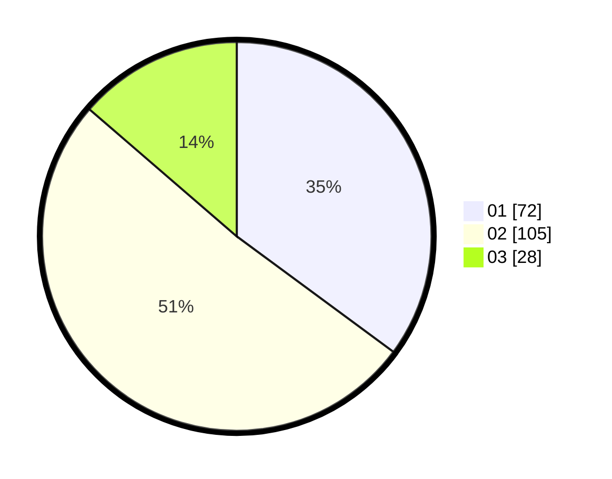

# Hasil

Hasil perolehan suara paslon dapat dilihat pada file paslon-01.txt, paslon-02.txt, dan paslon-03.txt.

Jika tidak ada, artinya data tersebut belum ada pada SIREKAP.

## Perolehan Suara

 * Paslon 01: **72**.
 * Paslon 02: **105**.
 * Paslon 03: **28**.

## Foto C Plano

https://sirekap-obj-formc.kpu.go.id/a7a7/pemilu/ppwp/31/73/01/10/02/3173011002101-20240215-075423--d446de8c-bd6f-43b2-b78f-6cbefdfcde72.jpg

https://sirekap-obj-formc.kpu.go.id/a7a7/pemilu/ppwp/31/73/01/10/02/3173011002101-20240215-075523--78175ad1-b677-4b07-9d2e-8e1197efa115.jpg

https://sirekap-obj-formc.kpu.go.id/a7a7/pemilu/ppwp/31/73/01/10/02/3173011002101-20240215-075814--29650e3b-3b8b-4c62-ba6a-23284b5a914a.jpg
