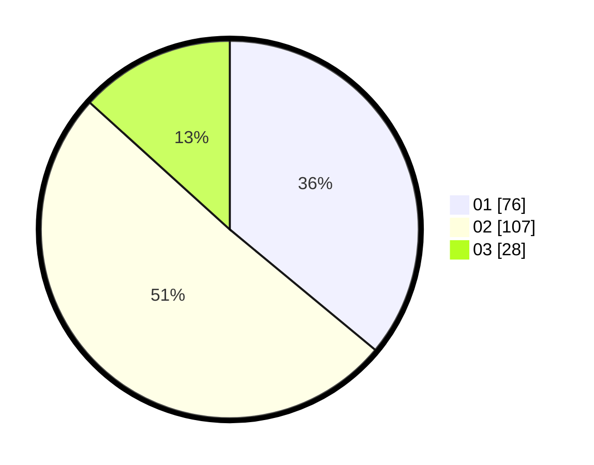

# Hasil

Hasil perolehan suara paslon dapat dilihat pada file paslon-01.txt, paslon-02.txt, dan paslon-03.txt.

Jika tidak ada, artinya data tersebut belum ada pada SIREKAP.

## Perolehan Suara

 * Paslon 01: **76**.
 * Paslon 02: **107**.
 * Paslon 03: **28**.

## Foto C Plano

https://sirekap-obj-formc.kpu.go.id/3e60/pemilu/ppwp/31/73/01/10/02/3173011002106-20240215-031256--581145f0-af43-40d7-aa6a-d7527ccdae73.jpg

https://sirekap-obj-formc.kpu.go.id/3e60/pemilu/ppwp/31/73/01/10/02/3173011002106-20240215-031406--d728db27-1ca8-4316-87c6-3dbb8cb9d677.jpg

https://sirekap-obj-formc.kpu.go.id/3e60/pemilu/ppwp/31/73/01/10/02/3173011002106-20240215-031557--bd25ae91-15a3-4389-82a2-2bd3145fd67c.jpg
