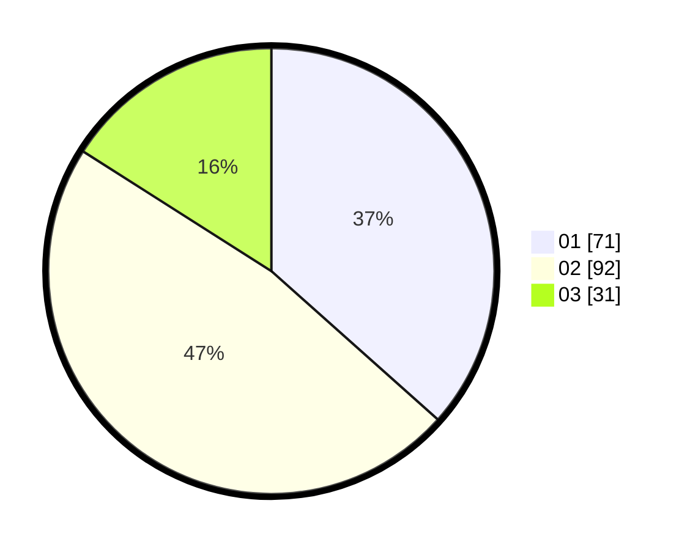

# Hasil

Hasil perolehan suara paslon dapat dilihat pada file paslon-01.txt, paslon-02.txt, dan paslon-03.txt.

Jika tidak ada, artinya data tersebut belum ada pada SIREKAP.

## Perolehan Suara

 * Paslon 01: **71**.
 * Paslon 02: **92**.
 * Paslon 03: **31**.

## Foto C Plano

https://sirekap-obj-formc.kpu.go.id/2bb9/pemilu/ppwp/31/73/01/10/02/3173011002107-20240216-142324--05eab816-afde-42e9-a0aa-df9cfccf9d8e.jpg

https://sirekap-obj-formc.kpu.go.id/2bb9/pemilu/ppwp/31/73/01/10/02/3173011002107-20240216-142325--0d74c065-adf4-4581-932b-817c7eb896b1.jpg

https://sirekap-obj-formc.kpu.go.id/2bb9/pemilu/ppwp/31/73/01/10/02/3173011002107-20240216-142325--a931fa3c-f96b-447d-ab00-b18eb1e0870e.jpg

## DATA PEMILIH TETAP

Jumlah pemilih dalam DPT: **272**.
 * L: **139**.
 * P: **133**.

## DATA PENGGUNA HAK PILIH

Jumlah pengguna hak pilih dalam DPT: **194**.
 * L: **97**.
 * P: **97**.

Jumlah pengguna hak pilih dalam DPTb: **0**.
 * L: **0**.
 * P: **0**.

Jumlah pengguna hak pilih dalam DPK: **5**.
 * L: **1**.
 * P: **4**.

Jumlah pengguna hak pilih: **199**.
 * L: **98**.
 * P: **111**.

## JUMLAH SUARA SAH DAN TIDAK SAH

JUMLAH SELURUH SUARA SAH: **194**.

JUMLAH SUARA TIDAK SAH: **5**.

JUMLAH SELURUH SUARA SAH DAN SUARA TIDAK SAH: **199**.
