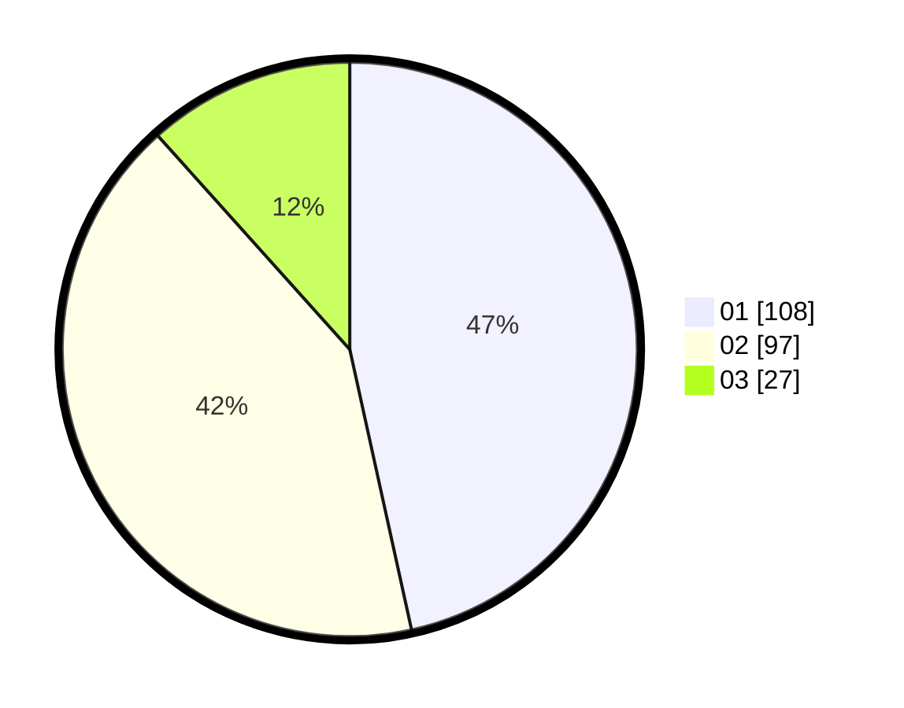

# Hasil

Hasil perolehan suara paslon dapat dilihat pada file paslon-01.txt, paslon-02.txt, dan paslon-03.txt.

Jika tidak ada, artinya data tersebut belum ada pada SIREKAP.

## Perolehan Suara

 * Paslon 01: **108**.
 * Paslon 02: **97**.
 * Paslon 03: **27**.

## Foto C Plano

https://sirekap-obj-formc.kpu.go.id/01c6/pemilu/ppwp/31/73/01/10/02/3173011002117-20240214-155514--46cf8e17-daac-45b0-a8bc-faf00a05f2d1.jpg

https://sirekap-obj-formc.kpu.go.id/01c6/pemilu/ppwp/31/73/01/10/02/3173011002117-20240214-155732--b68981a8-41d0-470f-a694-067d709741f1.jpg

https://sirekap-obj-formc.kpu.go.id/01c6/pemilu/ppwp/31/73/01/10/02/3173011002117-20240214-155809--fe9a1820-43b4-4035-9815-61bdcbce0251.jpg
