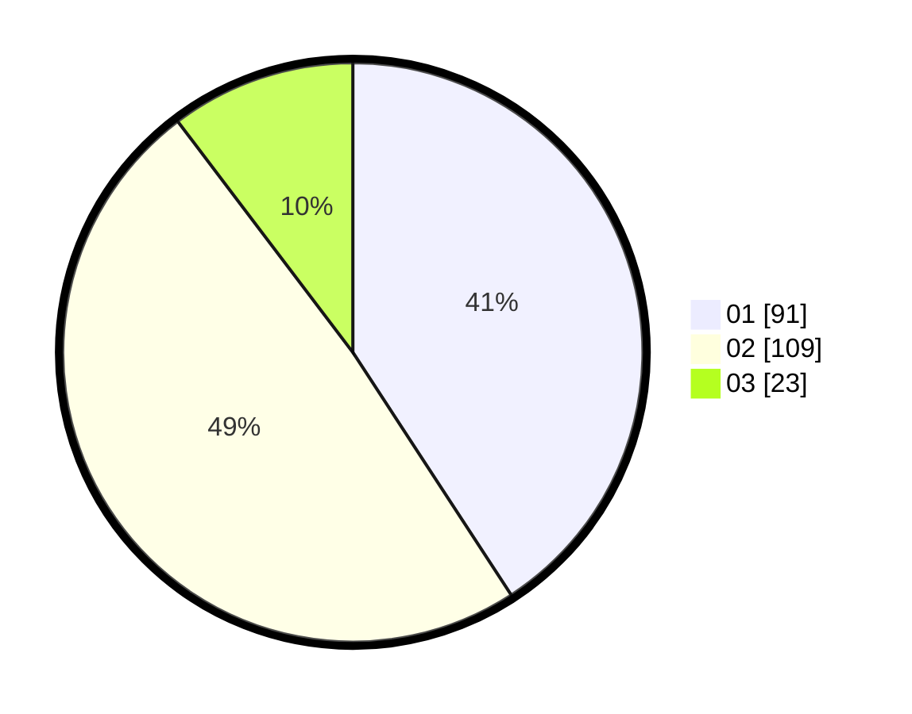

# Hasil

Hasil perolehan suara paslon dapat dilihat pada file paslon-01.txt, paslon-02.txt, dan paslon-03.txt.

Jika tidak ada, artinya data tersebut belum ada pada SIREKAP.

## Perolehan Suara

 * Paslon 01: **91**.
 * Paslon 02: **109**.
 * Paslon 03: **23**.

## Foto C Plano

https://sirekap-obj-formc.kpu.go.id/adc2/pemilu/ppwp/31/73/01/10/02/3173011002120-20240214-181604--5ef1aee3-b2a4-4b91-aaa1-6b586aa56c46.jpg

https://sirekap-obj-formc.kpu.go.id/adc2/pemilu/ppwp/31/73/01/10/02/3173011002120-20240215-043540--a3074eb6-2222-4622-a625-814c65c4d534.jpg

https://sirekap-obj-formc.kpu.go.id/adc2/pemilu/ppwp/31/73/01/10/02/3173011002120-20240214-190001--491f9dde-0a08-4ff7-944f-f167aae067fa.jpg

## DATA PEMILIH TETAP

Jumlah pemilih dalam DPT: **278**.
 * L: **141**.
 * P: **137**.

## DATA PENGGUNA HAK PILIH

Jumlah pengguna hak pilih dalam DPT: **226**.
 * L: **110**.
 * P: **116**.

Jumlah pengguna hak pilih dalam DPTb: **1**.
 * L: **1**.
 * P: **0**.

Jumlah pengguna hak pilih dalam DPK: **3**.
 * L: **1**.
 * P: **2**.

Jumlah pengguna hak pilih: **230**.
 * L: **112**.
 * P: **118**.

## JUMLAH SUARA SAH DAN TIDAK SAH

JUMLAH SELURUH SUARA SAH: **223**.

JUMLAH SUARA TIDAK SAH: **7**.

JUMLAH SELURUH SUARA SAH DAN SUARA TIDAK SAH: **230**.
