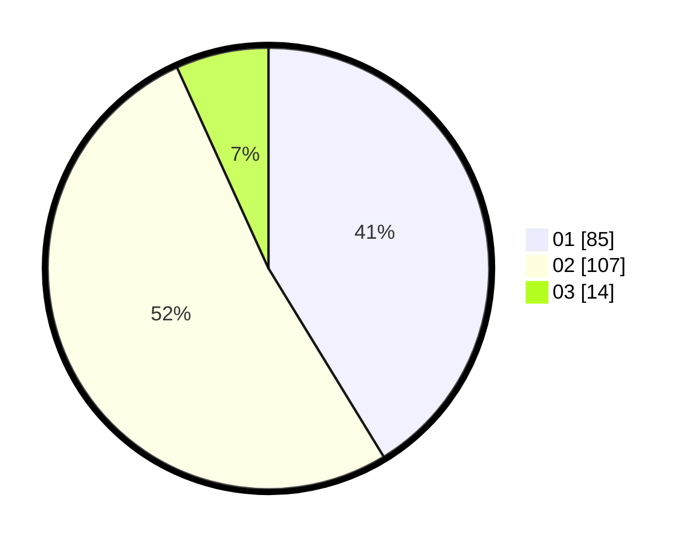

# Hasil

Hasil perolehan suara paslon dapat dilihat pada file paslon-01.txt, paslon-02.txt, dan paslon-03.txt.

Jika tidak ada, artinya data tersebut belum ada pada SIREKAP.

## Perolehan Suara

 * Paslon 01: **85**.
 * Paslon 02: **107**.
 * Paslon 03: **14**.

## Foto C Plano

https://sirekap-obj-formc.kpu.go.id/7cbd/pemilu/ppwp/31/73/01/10/02/3173011002123-20240214-221213--5d5de4b0-c222-4989-a529-0cc3b00408b5.jpg

https://sirekap-obj-formc.kpu.go.id/7cbd/pemilu/ppwp/31/73/01/10/02/3173011002123-20240214-221335--ae8ac48e-47b7-4092-b7fe-fd27bb96619c.jpg

https://sirekap-obj-formc.kpu.go.id/7cbd/pemilu/ppwp/31/73/01/10/02/3173011002123-20240215-102424--a8e8e1b1-3086-411c-bff3-313191bf3f7d.jpg

## DATA PEMILIH TETAP

Jumlah pemilih dalam DPT: **247**.
 * L: **134**.
 * P: **113**.

## DATA PENGGUNA HAK PILIH

Jumlah pengguna hak pilih dalam DPT: **205**.
 * L: **110**.
 * P: **95**.

Jumlah pengguna hak pilih dalam DPTb: **0**.
 * L: **0**.
 * P: **0**.

Jumlah pengguna hak pilih dalam DPK: **2**.
 * L: **1**.
 * P: **1**.

Jumlah pengguna hak pilih: **207**.
 * L: **111**.
 * P: **96**.

## JUMLAH SUARA SAH DAN TIDAK SAH

JUMLAH SELURUH SUARA SAH: **202**.

JUMLAH SUARA TIDAK SAH: **5**.

JUMLAH SELURUH SUARA SAH DAN SUARA TIDAK SAH: **207**.
