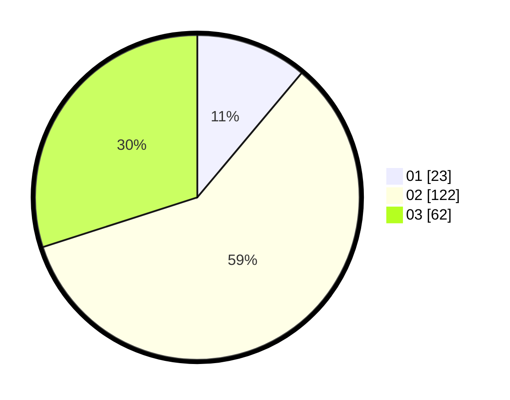

# Hasil

Hasil perolehan suara paslon dapat dilihat pada file paslon-01.txt, paslon-02.txt, dan paslon-03.txt.

Jika tidak ada, artinya data tersebut belum ada pada SIREKAP.

## Perolehan Suara

 * Paslon 01: **23**.
 * Paslon 02: **122**.
 * Paslon 03: **62**.

## Foto C Plano

https://sirekap-obj-formc.kpu.go.id/0881/pemilu/ppwp/31/73/01/10/02/3173011002124-20240214-155826--285518d3-8845-4fd0-908a-bbb515125e1f.jpg

https://sirekap-obj-formc.kpu.go.id/0881/pemilu/ppwp/31/73/01/10/02/3173011002124-20240214-155600--54572705-de1d-4da6-bc27-0f08ae10b2e1.jpg

https://sirekap-obj-formc.kpu.go.id/0881/pemilu/ppwp/31/73/01/10/02/3173011002124-20240214-155732--f88a12f5-2f19-432d-8c90-fb1b2e1d2c61.jpg

## DATA PEMILIH TETAP

Jumlah pemilih dalam DPT: **283**.
 * L: **138**.
 * P: **145**.

## DATA PENGGUNA HAK PILIH

Jumlah pengguna hak pilih dalam DPT: **182**.
 * L: **88**.
 * P: **94**.

Jumlah pengguna hak pilih dalam DPTb: **20**.
 * L: **10**.
 * P: **10**.

Jumlah pengguna hak pilih dalam DPK: **5**.
 * L: **2**.
 * P: **3**.

Jumlah pengguna hak pilih: **207**.
 * L: **100**.
 * P: **107**.

## JUMLAH SUARA SAH DAN TIDAK SAH

JUMLAH SELURUH SUARA SAH: **207**.

JUMLAH SUARA TIDAK SAH: **0**.

JUMLAH SELURUH SUARA SAH DAN SUARA TIDAK SAH: **207**.
