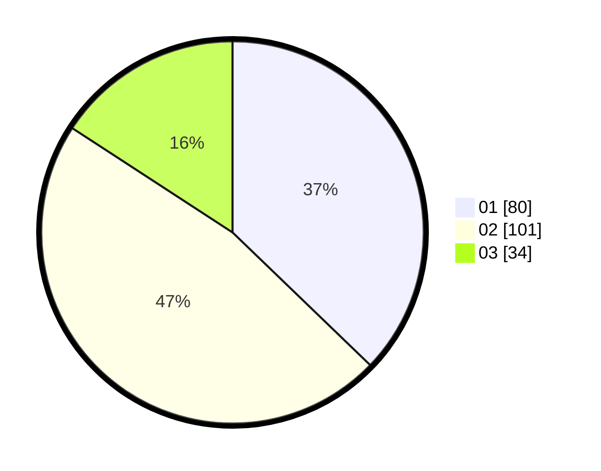

# Hasil

Hasil perolehan suara paslon dapat dilihat pada file paslon-01.txt, paslon-02.txt, dan paslon-03.txt.

Jika tidak ada, artinya data tersebut belum ada pada SIREKAP.

## Perolehan Suara

 * Paslon 01: **80**.
 * Paslon 02: **101**.
 * Paslon 03: **34**.

## Foto C Plano

https://sirekap-obj-formc.kpu.go.id/e18b/pemilu/ppwp/31/73/01/10/02/3173011002127-20240216-151037--8b796f71-36c1-42d8-b3db-2d3b5072f629.jpg

https://sirekap-obj-formc.kpu.go.id/e18b/pemilu/ppwp/31/73/01/10/02/3173011002127-20240216-151038--e3aeaee3-dea2-48ce-9e86-3edac7433568.jpg

https://sirekap-obj-formc.kpu.go.id/e18b/pemilu/ppwp/31/73/01/10/02/3173011002127-20240216-151037--261ab314-b2bc-4f84-bc61-78cdcef8f68f.jpg

## DATA PEMILIH TETAP

Jumlah pemilih dalam DPT: **0**.
 * L: **0**.
 * P: **0**.

## DATA PENGGUNA HAK PILIH

Jumlah pengguna hak pilih dalam DPT: **0**.
 * L: **0**.
 * P: **0**.

Jumlah pengguna hak pilih dalam DPTb: **0**.
 * L: **0**.
 * P: **0**.

Jumlah pengguna hak pilih dalam DPK: **0**.
 * L: **0**.
 * P: **0**.

Jumlah pengguna hak pilih: **0**.
 * L: **0**.
 * P: **0**.

## JUMLAH SUARA SAH DAN TIDAK SAH

JUMLAH SELURUH SUARA SAH: **218**.

JUMLAH SUARA TIDAK SAH: **3**.

JUMLAH SELURUH SUARA SAH DAN SUARA TIDAK SAH: **221**.
