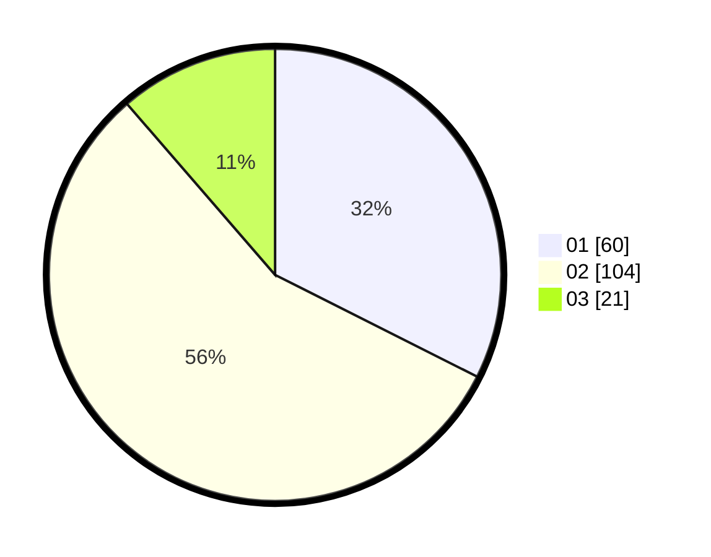

# Hasil

Hasil perolehan suara paslon dapat dilihat pada file paslon-01.txt, paslon-02.txt, dan paslon-03.txt.

Jika tidak ada, artinya data tersebut belum ada pada SIREKAP.

## Perolehan Suara

 * Paslon 01: **60**.
 * Paslon 02: **104**.
 * Paslon 03: **21**.

## Foto C Plano

https://sirekap-obj-formc.kpu.go.id/8545/pemilu/ppwp/31/73/01/10/02/3173011002129-20240216-171913--3ff59d23-9c9e-43f7-9407-2884df3c9883.jpg

https://sirekap-obj-formc.kpu.go.id/8545/pemilu/ppwp/31/73/01/10/02/3173011002129-20240216-073337--d3ac4679-75f4-4130-a029-f98faaf0117f.jpg

https://sirekap-obj-formc.kpu.go.id/8545/pemilu/ppwp/31/73/01/10/02/3173011002129-20240216-073331--037cb46e-1492-425a-b577-368c40f28bf5.jpg

## DATA PEMILIH TETAP

Jumlah pemilih dalam DPT: **270**.
 * L: **138**.
 * P: **132**.

## DATA PENGGUNA HAK PILIH

Jumlah pengguna hak pilih dalam DPT: **184**.
 * L: **90**.
 * P: **94**.

Jumlah pengguna hak pilih dalam DPTb: **0**.
 * L: **0**.
 * P: **0**.

Jumlah pengguna hak pilih dalam DPK: **2**.
 * L: **1**.
 * P: **1**.

Jumlah pengguna hak pilih: **186**.
 * L: **91**.
 * P: **95**.

## JUMLAH SUARA SAH DAN TIDAK SAH

JUMLAH SELURUH SUARA SAH: **185**.

JUMLAH SUARA TIDAK SAH: **1**.

JUMLAH SELURUH SUARA SAH DAN SUARA TIDAK SAH: **186**.
