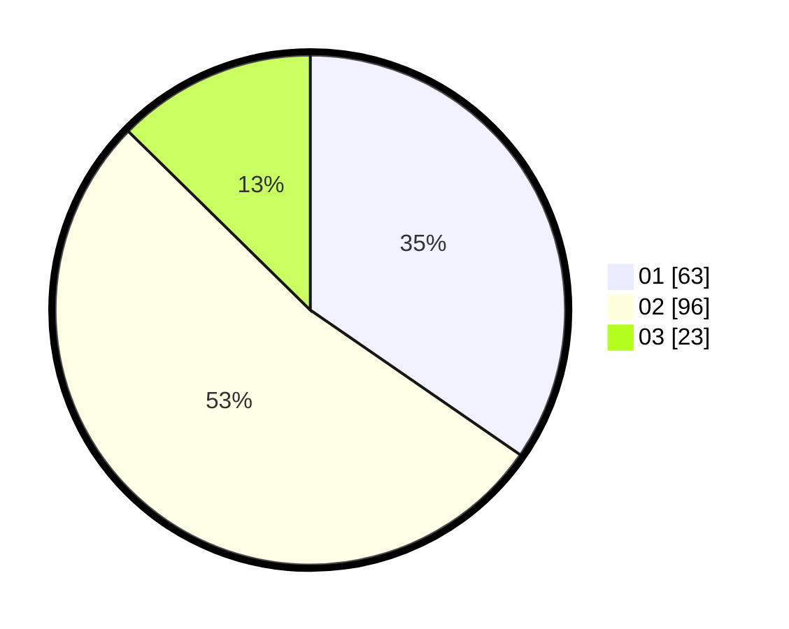

# Hasil

Hasil perolehan suara paslon dapat dilihat pada file paslon-01.txt, paslon-02.txt, dan paslon-03.txt.

Jika tidak ada, artinya data tersebut belum ada pada SIREKAP.

## Perolehan Suara

 * Paslon 01: **63**.
 * Paslon 02: **96**.
 * Paslon 03: **23**.

## Foto C Plano

https://sirekap-obj-formc.kpu.go.id/3180/pemilu/ppwp/31/73/01/10/02/3173011002130-20240216-134204--24a7abda-257a-4860-abf3-c63f2474c0e2.jpg

https://sirekap-obj-formc.kpu.go.id/3180/pemilu/ppwp/31/73/01/10/02/3173011002130-20240216-134206--c85e686d-19c8-45b0-82bb-99966a434c9c.jpg

https://sirekap-obj-formc.kpu.go.id/3180/pemilu/ppwp/31/73/01/10/02/3173011002130-20240216-134205--4f4453f6-f42a-44dc-9078-117235773f87.jpg

## DATA PEMILIH TETAP

Jumlah pemilih dalam DPT: **271**.
 * L: **135**.
 * P: **136**.

## DATA PENGGUNA HAK PILIH

Jumlah pengguna hak pilih dalam DPT: **178**.
 * L: **89**.
 * P: **89**.

Jumlah pengguna hak pilih dalam DPTb: **0**.
 * L: **0**.
 * P: **0**.

Jumlah pengguna hak pilih dalam DPK: **5**.
 * L: **3**.
 * P: **2**.

Jumlah pengguna hak pilih: **183**.
 * L: **92**.
 * P: **91**.

## JUMLAH SUARA SAH DAN TIDAK SAH

JUMLAH SELURUH SUARA SAH: **182**.

JUMLAH SUARA TIDAK SAH: **1**.

JUMLAH SELURUH SUARA SAH DAN SUARA TIDAK SAH: **183**.
