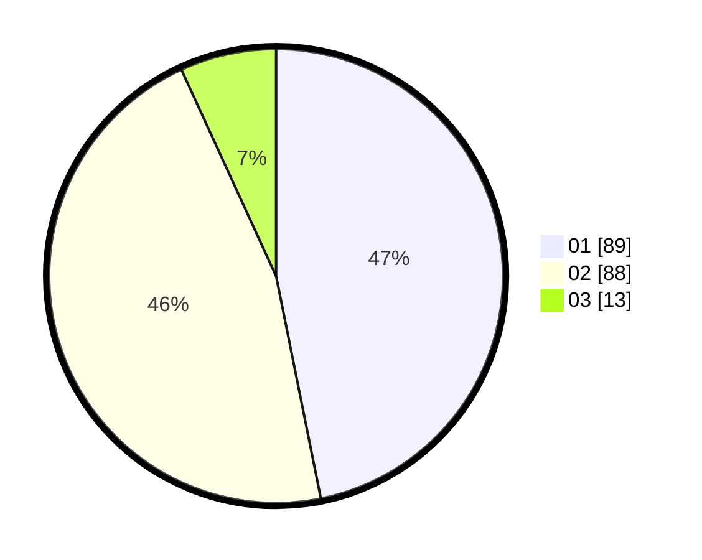

# Hasil

Hasil perolehan suara paslon dapat dilihat pada file paslon-01.txt, paslon-02.txt, dan paslon-03.txt.

Jika tidak ada, artinya data tersebut belum ada pada SIREKAP.

## Perolehan Suara

 * Paslon 01: **89**.
 * Paslon 02: **88**.
 * Paslon 03: **13**.

## Foto C Plano

https://sirekap-obj-formc.kpu.go.id/bc7b/pemilu/ppwp/31/73/01/10/02/3173011002131-20240216-070417--4f422d65-a346-4d59-9abc-58d131a31be9.jpg

https://sirekap-obj-formc.kpu.go.id/bc7b/pemilu/ppwp/31/73/01/10/02/3173011002131-20240216-070429--e6c97cb0-a3ad-49ea-9428-9291414870e2.jpg

https://sirekap-obj-formc.kpu.go.id/bc7b/pemilu/ppwp/31/73/01/10/02/3173011002131-20240216-070424--0dd4156f-925c-4e49-8ca7-9ef509551353.jpg

## DATA PEMILIH TETAP

Jumlah pemilih dalam DPT: **268**.
 * L: **136**.
 * P: **132**.

## DATA PENGGUNA HAK PILIH

Jumlah pengguna hak pilih dalam DPT: **184**.
 * L: **89**.
 * P: **95**.

Jumlah pengguna hak pilih dalam DPTb: **0**.
 * L: **0**.
 * P: **0**.

Jumlah pengguna hak pilih dalam DPK: **9**.
 * L: **3**.
 * P: **6**.

Jumlah pengguna hak pilih: **193**.
 * L: **92**.
 * P: **101**.

## JUMLAH SUARA SAH DAN TIDAK SAH

JUMLAH SELURUH SUARA SAH: **190**.

JUMLAH SUARA TIDAK SAH: **3**.

JUMLAH SELURUH SUARA SAH DAN SUARA TIDAK SAH: **193**.
