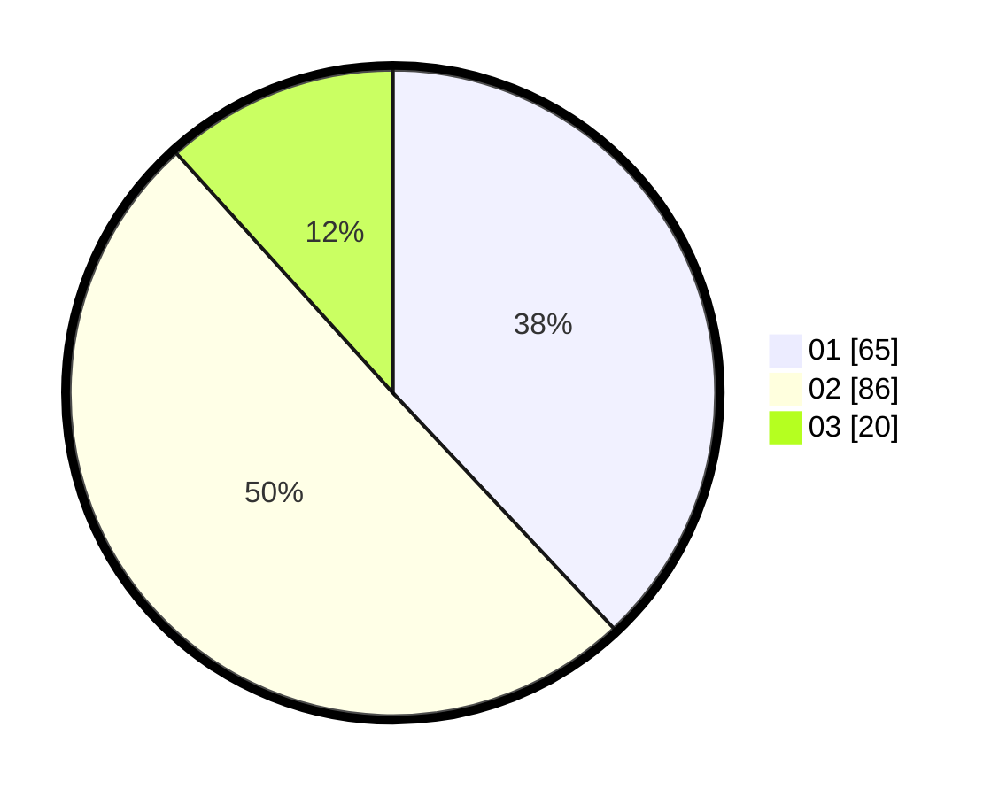

# Hasil

Hasil perolehan suara paslon dapat dilihat pada file paslon-01.txt, paslon-02.txt, dan paslon-03.txt.

Jika tidak ada, artinya data tersebut belum ada pada SIREKAP.

## Perolehan Suara

 * Paslon 01: **65**.
 * Paslon 02: **86**.
 * Paslon 03: **20**.

## Foto C Plano

https://sirekap-obj-formc.kpu.go.id/2aa9/pemilu/ppwp/31/73/01/10/02/3173011002132-20240216-153553--e0c8258c-6449-4c8c-8916-b1c24449dbca.jpg

https://sirekap-obj-formc.kpu.go.id/2aa9/pemilu/ppwp/31/73/01/10/02/3173011002132-20240216-133617--ae3fbbb8-6d4e-42b1-be29-570b2512fd75.jpg

https://sirekap-obj-formc.kpu.go.id/2aa9/pemilu/ppwp/31/73/01/10/02/3173011002132-20240216-153553--e63ba93e-63d9-4f99-8b61-e8f1efa056d4.jpg

## DATA PEMILIH TETAP

Jumlah pemilih dalam DPT: **271**.
 * L: **134**.
 * P: **137**.

## DATA PENGGUNA HAK PILIH

Jumlah pengguna hak pilih dalam DPT: **172**.
 * L: **81**.
 * P: **91**.

Jumlah pengguna hak pilih dalam DPTb: **0**.
 * L: **0**.
 * P: **0**.

Jumlah pengguna hak pilih dalam DPK: **5**.
 * L: **4**.
 * P: **1**.

Jumlah pengguna hak pilih: **177**.
 * L: **85**.
 * P: **92**.

## JUMLAH SUARA SAH DAN TIDAK SAH

JUMLAH SELURUH SUARA SAH: **171**.

JUMLAH SUARA TIDAK SAH: **6**.

JUMLAH SELURUH SUARA SAH DAN SUARA TIDAK SAH: **177**.
