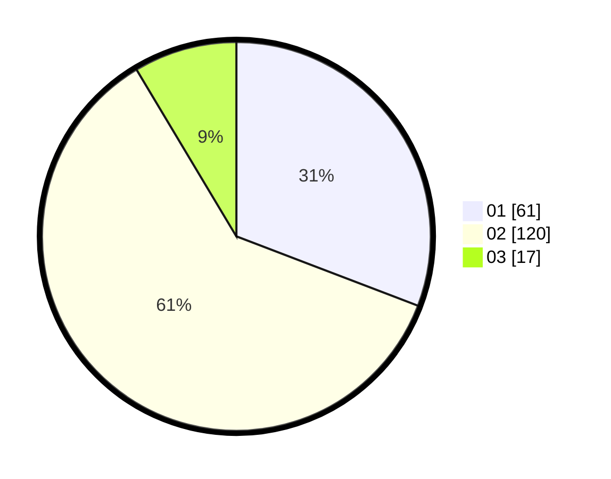

# Hasil

Hasil perolehan suara paslon dapat dilihat pada file paslon-01.txt, paslon-02.txt, dan paslon-03.txt.

Jika tidak ada, artinya data tersebut belum ada pada SIREKAP.

## Perolehan Suara

 * Paslon 01: **61**.
 * Paslon 02: **120**.
 * Paslon 03: **17**.

## Foto C Plano

https://sirekap-obj-formc.kpu.go.id/d7b4/pemilu/ppwp/31/73/01/10/02/3173011002138-20240216-150333--4bbbc51b-6ad7-42f6-90dc-0edb0bdecae5.jpg

https://sirekap-obj-formc.kpu.go.id/d7b4/pemilu/ppwp/31/73/01/10/02/3173011002138-20240216-150335--c4f09a92-a61a-463f-ae07-063fdb10a5c0.jpg

https://sirekap-obj-formc.kpu.go.id/d7b4/pemilu/ppwp/31/73/01/10/02/3173011002138-20240216-150334--709829b4-d5e1-4f0a-8b63-5c95074ecf68.jpg

## DATA PEMILIH TETAP

Jumlah pemilih dalam DPT: **269**.
 * L: **132**.
 * P: **137**.

## DATA PENGGUNA HAK PILIH

Jumlah pengguna hak pilih dalam DPT: **194**.
 * L: **95**.
 * P: **99**.

Jumlah pengguna hak pilih dalam DPTb: **2**.
 * L: **1**.
 * P: **1**.

Jumlah pengguna hak pilih dalam DPK: **2**.
 * L: **1**.
 * P: **1**.

Jumlah pengguna hak pilih: **198**.
 * L: **97**.
 * P: **101**.

## JUMLAH SUARA SAH DAN TIDAK SAH

JUMLAH SELURUH SUARA SAH: **198**.

JUMLAH SUARA TIDAK SAH: **1**.

JUMLAH SELURUH SUARA SAH DAN SUARA TIDAK SAH: **199**.
