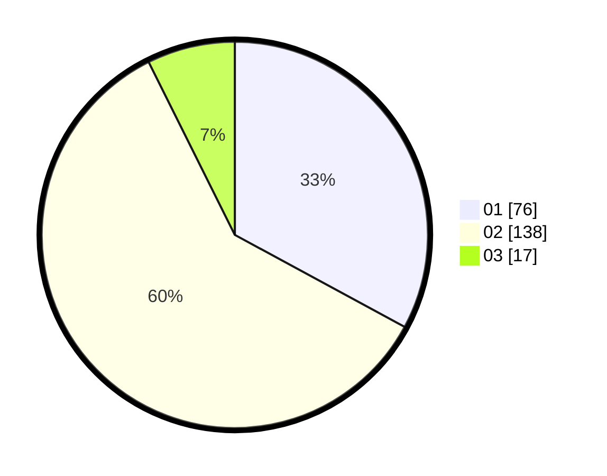

# Hasil

Hasil perolehan suara paslon dapat dilihat pada file paslon-01.txt, paslon-02.txt, dan paslon-03.txt.

Jika tidak ada, artinya data tersebut belum ada pada SIREKAP.

## Perolehan Suara

 * Paslon 01: **76**.
 * Paslon 02: **138**.
 * Paslon 03: **17**.

## Foto C Plano

https://sirekap-obj-formc.kpu.go.id/d39c/pemilu/ppwp/31/73/01/10/02/3173011002141-20240216-030321--ac0e1db4-088e-4cb5-b5fb-268d16946564.jpg

https://sirekap-obj-formc.kpu.go.id/d39c/pemilu/ppwp/31/73/01/10/02/3173011002141-20240216-030245--7080e7ce-7b06-4205-b6fc-4c9b4b376b53.jpg

https://sirekap-obj-formc.kpu.go.id/d39c/pemilu/ppwp/31/73/01/10/02/3173011002141-20240216-030244--913aa6a6-10af-4edf-863c-6c9d7a7b3103.jpg

## DATA PEMILIH TETAP

Jumlah pemilih dalam DPT: **270**.
 * L: **140**.
 * P: **130**.

## DATA PENGGUNA HAK PILIH

Jumlah pengguna hak pilih dalam DPT: **228**.
 * L: **115**.
 * P: **113**.

Jumlah pengguna hak pilih dalam DPTb: **0**.
 * L: **0**.
 * P: **0**.

Jumlah pengguna hak pilih dalam DPK: **0**.
 * L: **0**.
 * P: **0**.

Jumlah pengguna hak pilih: **228**.
 * L: **115**.
 * P: **113**.

## JUMLAH SUARA SAH DAN TIDAK SAH

JUMLAH SELURUH SUARA SAH: **228**.

JUMLAH SUARA TIDAK SAH: **0**.

JUMLAH SELURUH SUARA SAH DAN SUARA TIDAK SAH: **228**.
