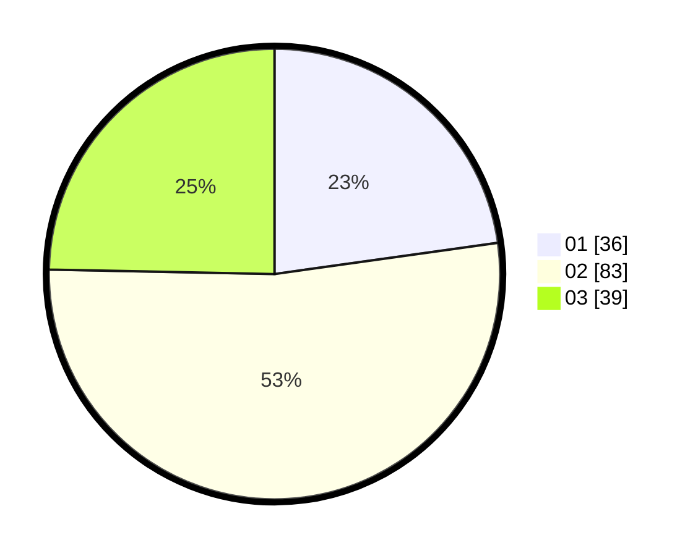

# Hasil

Hasil perolehan suara paslon dapat dilihat pada file paslon-01.txt, paslon-02.txt, dan paslon-03.txt.

Jika tidak ada, artinya data tersebut belum ada pada SIREKAP.

## Perolehan Suara

 * Paslon 01: **36**.
 * Paslon 02: **83**.
 * Paslon 03: **39**.

## Foto C Plano

https://sirekap-obj-formc.kpu.go.id/0cc7/pemilu/ppwp/31/73/01/10/02/3173011002144-20240214-194353--6d33c937-363a-489f-b187-e8b97e50dbe3.jpg

https://sirekap-obj-formc.kpu.go.id/0cc7/pemilu/ppwp/31/73/01/10/02/3173011002144-20240214-194531--7ded0be3-63b3-42e9-9723-01eb712327fb.jpg

https://sirekap-obj-formc.kpu.go.id/0cc7/pemilu/ppwp/31/73/01/10/02/3173011002144-20240214-194649--145fe123-c5cc-4f63-a90b-a4257922223f.jpg

## DATA PEMILIH TETAP

Jumlah pemilih dalam DPT: **196**.
 * L: **96**.
 * P: **100**.

## DATA PENGGUNA HAK PILIH

Jumlah pengguna hak pilih dalam DPT: **147**.
 * L: **71**.
 * P: **76**.

Jumlah pengguna hak pilih dalam DPTb: **9**.
 * L: **3**.
 * P: **6**.

Jumlah pengguna hak pilih dalam DPK: **4**.
 * L: **2**.
 * P: **2**.

Jumlah pengguna hak pilih: **160**.
 * L: **76**.
 * P: **84**.

## JUMLAH SUARA SAH DAN TIDAK SAH

JUMLAH SELURUH SUARA SAH: **158**.

JUMLAH SUARA TIDAK SAH: **2**.

JUMLAH SELURUH SUARA SAH DAN SUARA TIDAK SAH: **160**.
