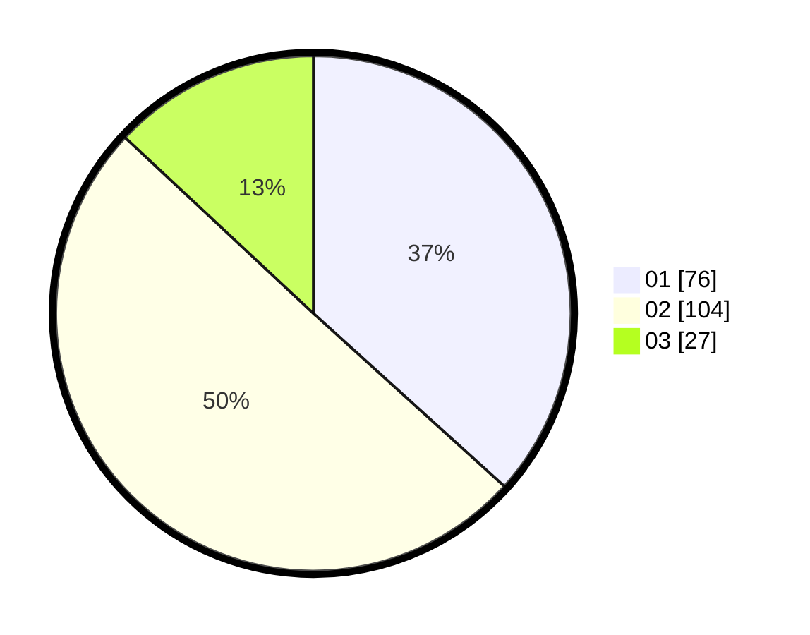

# Hasil

Hasil perolehan suara paslon dapat dilihat pada file paslon-01.txt, paslon-02.txt, dan paslon-03.txt.

Jika tidak ada, artinya data tersebut belum ada pada SIREKAP.

## Perolehan Suara

 * Paslon 01: **76**.
 * Paslon 02: **104**.
 * Paslon 03: **27**.

## Foto C Plano

https://sirekap-obj-formc.kpu.go.id/cdd1/pemilu/ppwp/31/73/01/10/02/3173011002145-20240214-204835--8c80dfc2-6cf1-4ac6-a2a6-814599e5af8c.jpg

https://sirekap-obj-formc.kpu.go.id/cdd1/pemilu/ppwp/31/73/01/10/02/3173011002145-20240214-223545--0f8eb999-3a18-41dd-9a9b-a0cd62b9d26e.jpg

https://sirekap-obj-formc.kpu.go.id/cdd1/pemilu/ppwp/31/73/01/10/02/3173011002145-20240214-223641--99a65d9e-4a80-4598-b186-be6b9ed93464.jpg
