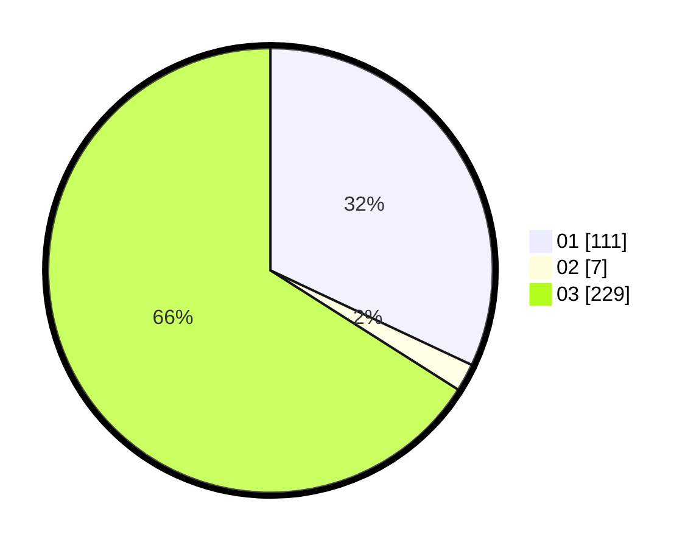

# Hasil

Hasil perolehan suara paslon dapat dilihat pada file paslon-01.txt, paslon-02.txt, dan paslon-03.txt.

Jika tidak ada, artinya data tersebut belum ada pada SIREKAP.

## Perolehan Suara

 * Paslon 01: **111**.
 * Paslon 02: **7**.
 * Paslon 03: **229**.

## Foto C Plano

https://sirekap-obj-formc.kpu.go.id/1f57/pemilu/ppwp/31/73/01/10/02/3173011002150-20240216-175926--65e81b75-23db-4924-9581-4353722ad21b.jpg

https://sirekap-obj-formc.kpu.go.id/1f57/pemilu/ppwp/31/73/01/10/02/3173011002150-20240216-051807--746c168c-de60-40df-a0a2-2e5d7d62ebcd.jpg

https://sirekap-obj-formc.kpu.go.id/1f57/pemilu/ppwp/31/73/01/10/02/3173011002150-20240216-051805--97961cdd-bb80-4202-a59c-bb41a6657f45.jpg

## DATA PEMILIH TETAP

Jumlah pemilih dalam DPT: **269**.
 * L: **130**.
 * P: **139**.

## DATA PENGGUNA HAK PILIH

Jumlah pengguna hak pilih dalam DPT: **214**.
 * L: **98**.
 * P: **116**.

Jumlah pengguna hak pilih dalam DPTb: **14**.
 * L: **5**.
 * P: **9**.

Jumlah pengguna hak pilih dalam DPK: **1**.
 * L: **0**.
 * P: **1**.

Jumlah pengguna hak pilih: **229**.
 * L: **103**.
 * P: **126**.

## JUMLAH SUARA SAH DAN TIDAK SAH

JUMLAH SELURUH SUARA SAH: **227**.

JUMLAH SUARA TIDAK SAH: **2**.

JUMLAH SELURUH SUARA SAH DAN SUARA TIDAK SAH: **229**.
