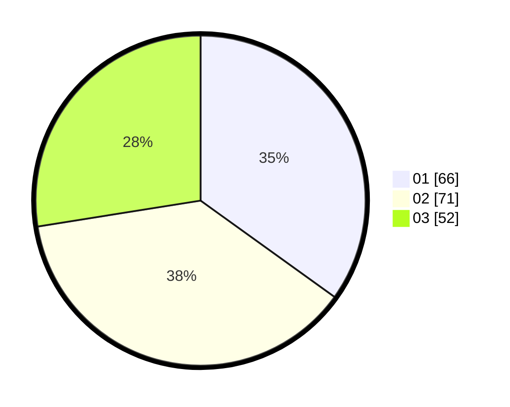

# Hasil

Hasil perolehan suara paslon dapat dilihat pada file paslon-01.txt, paslon-02.txt, dan paslon-03.txt.

Jika tidak ada, artinya data tersebut belum ada pada SIREKAP.

## Perolehan Suara

 * Paslon 01: **66**.
 * Paslon 02: **71**.
 * Paslon 03: **52**.

## Foto C Plano

https://sirekap-obj-formc.kpu.go.id/d7ae/pemilu/ppwp/31/73/01/10/02/3173011002153-20240215-000303--ae96315f-0e6a-42ff-9370-d1d107c7f3aa.jpg

https://sirekap-obj-formc.kpu.go.id/d7ae/pemilu/ppwp/31/73/01/10/02/3173011002153-20240215-000341--e7bb505b-c7af-4fb9-bad7-25d1f66cb278.jpg

https://sirekap-obj-formc.kpu.go.id/d7ae/pemilu/ppwp/31/73/01/10/02/3173011002153-20240215-015110--14b9b792-32d4-4382-976f-c48cb96f890f.jpg
