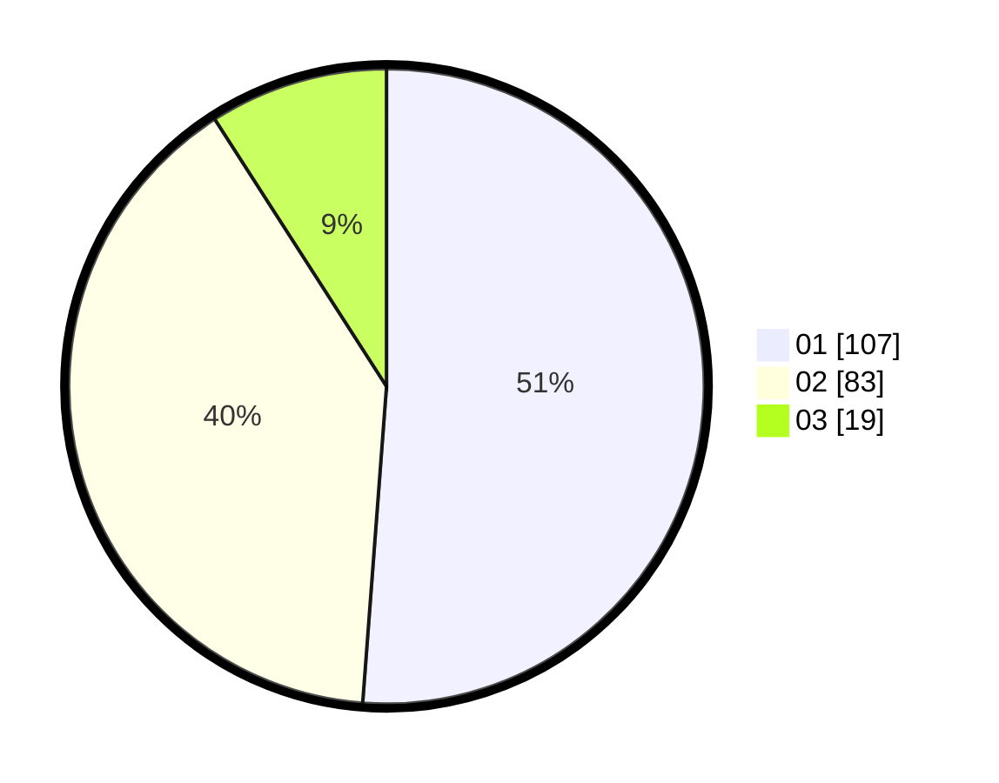

# Hasil

Hasil perolehan suara paslon dapat dilihat pada file paslon-01.txt, paslon-02.txt, dan paslon-03.txt.

Jika tidak ada, artinya data tersebut belum ada pada SIREKAP.

## Perolehan Suara

 * Paslon 01: **107**.
 * Paslon 02: **83**.
 * Paslon 03: **19**.

## Foto C Plano

https://sirekap-obj-formc.kpu.go.id/01f1/pemilu/ppwp/31/73/01/10/02/3173011002159-20240215-094533--65bf7608-519e-48a6-8894-b7b752159cc2.jpg

https://sirekap-obj-formc.kpu.go.id/01f1/pemilu/ppwp/31/73/01/10/02/3173011002159-20240214-193020--551cf8df-6922-4bb5-bc07-565f4805f5f2.jpg

https://sirekap-obj-formc.kpu.go.id/01f1/pemilu/ppwp/31/73/01/10/02/3173011002159-20240215-094709--7f7f0e91-5fb6-45e3-9c4c-d9100e01f298.jpg
