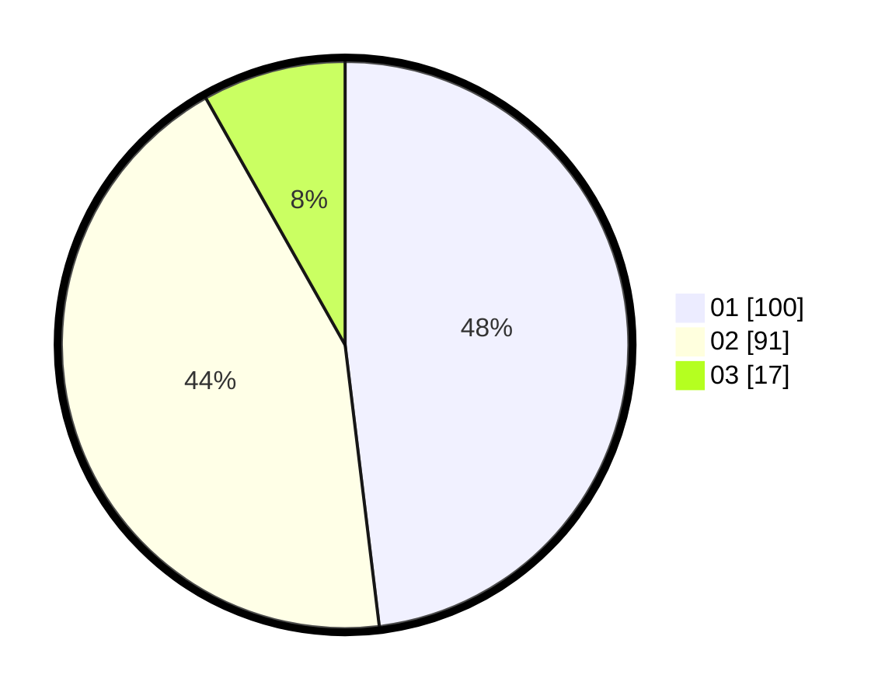

# Hasil

Hasil perolehan suara paslon dapat dilihat pada file paslon-01.txt, paslon-02.txt, dan paslon-03.txt.

Jika tidak ada, artinya data tersebut belum ada pada SIREKAP.

## Perolehan Suara

 * Paslon 01: **100**.
 * Paslon 02: **91**.
 * Paslon 03: **17**.

## Foto C Plano

https://sirekap-obj-formc.kpu.go.id/b5fc/pemilu/ppwp/31/73/01/10/02/3173011002161-20240214-192915--52a3256e-87e3-40f5-a4ae-5ece602eb33f.jpg

https://sirekap-obj-formc.kpu.go.id/b5fc/pemilu/ppwp/31/73/01/10/02/3173011002161-20240214-185848--df0541b4-5471-4625-b5eb-bb8c248335fd.jpg

https://sirekap-obj-formc.kpu.go.id/b5fc/pemilu/ppwp/31/73/01/10/02/3173011002161-20240214-190048--d2851d6d-7157-4633-a3ec-3d5436413aba.jpg

## DATA PEMILIH TETAP

Jumlah pemilih dalam DPT: **207**.
 * L: **99**.
 * P: **108**.

## DATA PENGGUNA HAK PILIH

Jumlah pengguna hak pilih dalam DPT: **207**.
 * L: **99**.
 * P: **108**.

Jumlah pengguna hak pilih dalam DPTb: **3**.
 * L: **2**.
 * P: **1**.

Jumlah pengguna hak pilih dalam DPK: **0**.
 * L: **0**.
 * P: **0**.

Jumlah pengguna hak pilih: **210**.
 * L: **101**.
 * P: **109**.

## JUMLAH SUARA SAH DAN TIDAK SAH

JUMLAH SELURUH SUARA SAH: **208**.

JUMLAH SUARA TIDAK SAH: **2**.

JUMLAH SELURUH SUARA SAH DAN SUARA TIDAK SAH: **210**.
