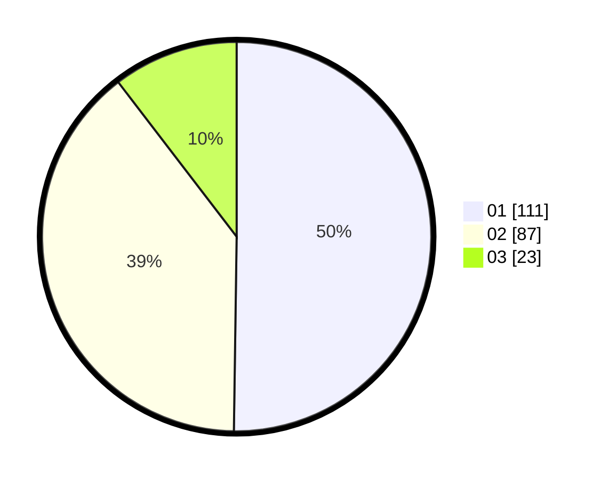

# Hasil

Hasil perolehan suara paslon dapat dilihat pada file paslon-01.txt, paslon-02.txt, dan paslon-03.txt.

Jika tidak ada, artinya data tersebut belum ada pada SIREKAP.

## Perolehan Suara

 * Paslon 01: **111**.
 * Paslon 02: **87**.
 * Paslon 03: **23**.

## Foto C Plano

https://sirekap-obj-formc.kpu.go.id/0468/pemilu/ppwp/31/73/01/10/02/3173011002162-20240216-032552--e322d4b9-e7b5-44be-bc02-a6c432eb6f97.jpg

https://sirekap-obj-formc.kpu.go.id/0468/pemilu/ppwp/31/73/01/10/02/3173011002162-20240216-032556--51e968e4-4377-4f70-b80d-f10fb9d8d60d.jpg

https://sirekap-obj-formc.kpu.go.id/0468/pemilu/ppwp/31/73/01/10/02/3173011002162-20240216-032555--a657b3cc-09c9-4f8b-abdb-d370a1d8fb68.jpg

## DATA PEMILIH TETAP

Jumlah pemilih dalam DPT: **221**.
 * L: **98**.
 * P: **123**.

## DATA PENGGUNA HAK PILIH

Jumlah pengguna hak pilih dalam DPT: **221**.
 * L: **98**.
 * P: **123**.

Jumlah pengguna hak pilih dalam DPTb: **5**.
 * L: **2**.
 * P: **3**.

Jumlah pengguna hak pilih dalam DPK: **1**.
 * L: **1**.
 * P: **0**.

Jumlah pengguna hak pilih: **227**.
 * L: **101**.
 * P: **126**.

## JUMLAH SUARA SAH DAN TIDAK SAH

JUMLAH SELURUH SUARA SAH: **221**.

JUMLAH SUARA TIDAK SAH: **6**.

JUMLAH SELURUH SUARA SAH DAN SUARA TIDAK SAH: **227**.
