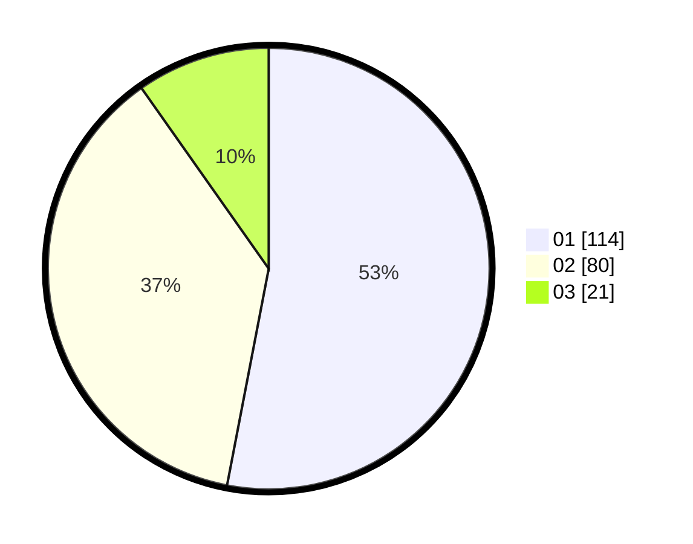

# Hasil

Hasil perolehan suara paslon dapat dilihat pada file paslon-01.txt, paslon-02.txt, dan paslon-03.txt.

Jika tidak ada, artinya data tersebut belum ada pada SIREKAP.

## Perolehan Suara

 * Paslon 01: **114**.
 * Paslon 02: **80**.
 * Paslon 03: **21**.

## Foto C Plano

https://sirekap-obj-formc.kpu.go.id/0273/pemilu/ppwp/31/73/01/10/02/3173011002164-20240214-193235--0652cc0d-1332-4ad8-ad5d-22b3400f0ef5.jpg

https://sirekap-obj-formc.kpu.go.id/0273/pemilu/ppwp/31/73/01/10/02/3173011002164-20240214-193250--3b6c1e18-71cd-475c-b107-865fce227e24.jpg

https://sirekap-obj-formc.kpu.go.id/0273/pemilu/ppwp/31/73/01/10/02/3173011002164-20240214-190559--200e07dc-c7e5-47ad-b63e-65db19e72ce9.jpg
