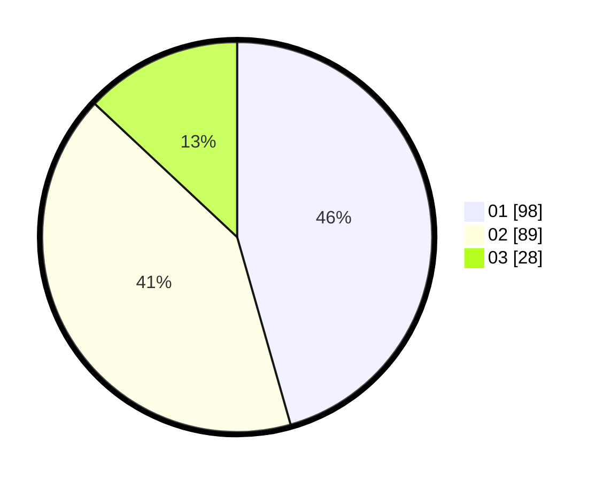

# Hasil

Hasil perolehan suara paslon dapat dilihat pada file paslon-01.txt, paslon-02.txt, dan paslon-03.txt.

Jika tidak ada, artinya data tersebut belum ada pada SIREKAP.

## Perolehan Suara

 * Paslon 01: **98**.
 * Paslon 02: **89**.
 * Paslon 03: **28**.

## Foto C Plano

https://sirekap-obj-formc.kpu.go.id/b492/pemilu/ppwp/31/73/01/10/02/3173011002166-20240216-150431--35beee60-97de-4e35-a2a6-5051bd2e3b68.jpg

https://sirekap-obj-formc.kpu.go.id/b492/pemilu/ppwp/31/73/01/10/02/3173011002166-20240216-150432--53b51b56-1aee-47f1-a122-d6d703b2b681.jpg

https://sirekap-obj-formc.kpu.go.id/b492/pemilu/ppwp/31/73/01/10/02/3173011002166-20240216-150432--c2b6ce14-3575-4203-8360-2126740fbc77.jpg

## DATA PEMILIH TETAP

Jumlah pemilih dalam DPT: **269**.
 * L: **124**.
 * P: **145**.

## DATA PENGGUNA HAK PILIH

Jumlah pengguna hak pilih dalam DPT: **214**.
 * L: **101**.
 * P: **113**.

Jumlah pengguna hak pilih dalam DPTb: **2**.
 * L: **0**.
 * P: **2**.

Jumlah pengguna hak pilih dalam DPK: **0**.
 * L: **0**.
 * P: **0**.

Jumlah pengguna hak pilih: **216**.
 * L: **101**.
 * P: **115**.

## JUMLAH SUARA SAH DAN TIDAK SAH

JUMLAH SELURUH SUARA SAH: **215**.

JUMLAH SUARA TIDAK SAH: **1**.

JUMLAH SELURUH SUARA SAH DAN SUARA TIDAK SAH: **216**.
