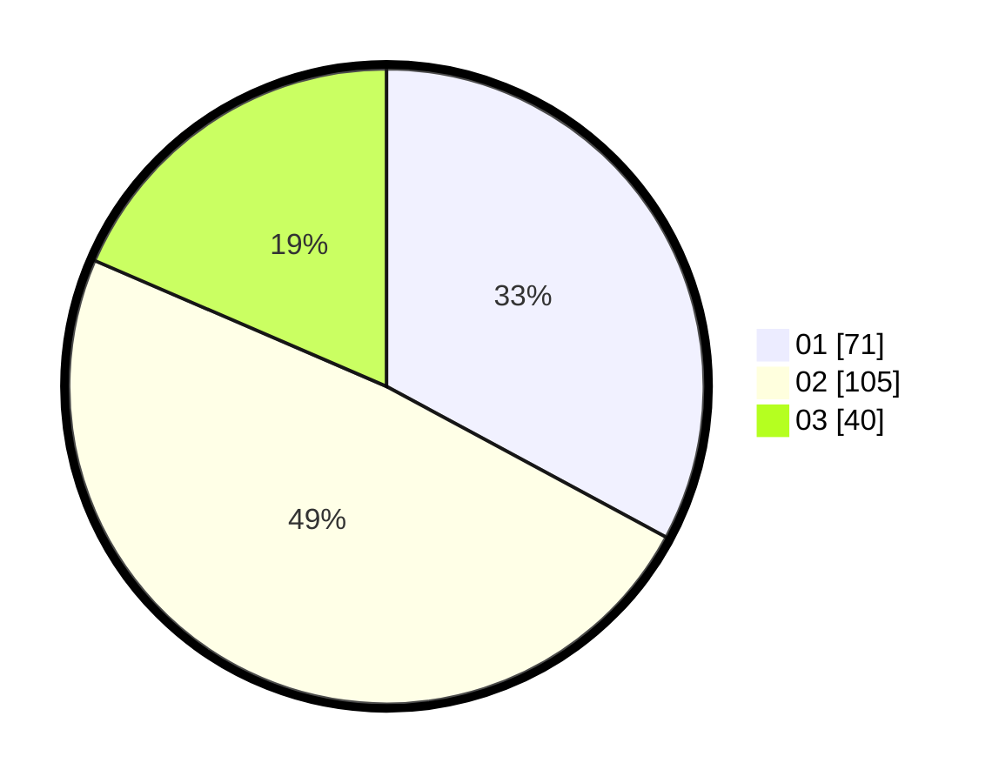

# Hasil

Hasil perolehan suara paslon dapat dilihat pada file paslon-01.txt, paslon-02.txt, dan paslon-03.txt.

Jika tidak ada, artinya data tersebut belum ada pada SIREKAP.

## Perolehan Suara

 * Paslon 01: **71**.
 * Paslon 02: **105**.
 * Paslon 03: **40**.

## Foto C Plano

https://sirekap-obj-formc.kpu.go.id/a561/pemilu/ppwp/31/73/01/10/02/3173011002173-20240214-190109--f111ac2f-eb00-4b46-bc7a-ea9ebb3859d7.jpg

https://sirekap-obj-formc.kpu.go.id/a561/pemilu/ppwp/31/73/01/10/02/3173011002173-20240214-190118--7998af17-c059-489e-8bf5-defcf40c9a8b.jpg

https://sirekap-obj-formc.kpu.go.id/a561/pemilu/ppwp/31/73/01/10/02/3173011002173-20240214-190128--b766ebb9-920f-4c87-8380-34f70b2584e4.jpg
