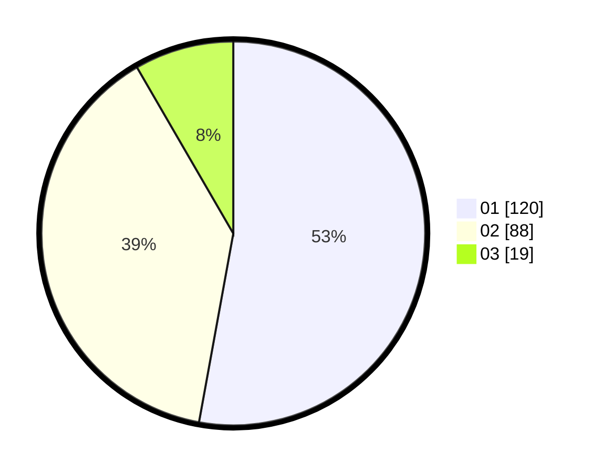

# Hasil

Hasil perolehan suara paslon dapat dilihat pada file paslon-01.txt, paslon-02.txt, dan paslon-03.txt.

Jika tidak ada, artinya data tersebut belum ada pada SIREKAP.

## Perolehan Suara

 * Paslon 01: **120**.
 * Paslon 02: **88**.
 * Paslon 03: **19**.

## Foto C Plano

https://sirekap-obj-formc.kpu.go.id/8722/pemilu/ppwp/31/73/01/10/02/3173011002174-20240216-015436--c3f4b10c-9fc5-4ed9-b6b9-2cb2e05bbd5d.jpg

https://sirekap-obj-formc.kpu.go.id/8722/pemilu/ppwp/31/73/01/10/02/3173011002174-20240216-015442--aa233d1b-b728-4e8e-8a5d-b4793cecee8d.jpg

https://sirekap-obj-formc.kpu.go.id/8722/pemilu/ppwp/31/73/01/10/02/3173011002174-20240216-015439--51443d2d-8350-4417-82fd-e146c3763019.jpg

## DATA PEMILIH TETAP

Jumlah pemilih dalam DPT: **224**.
 * L: **108**.
 * P: **116**.

## DATA PENGGUNA HAK PILIH

Jumlah pengguna hak pilih dalam DPT: **224**.
 * L: **108**.
 * P: **116**.

Jumlah pengguna hak pilih dalam DPTb: **5**.
 * L: **2**.
 * P: **3**.

Jumlah pengguna hak pilih dalam DPK: **2**.
 * L: **1**.
 * P: **1**.

Jumlah pengguna hak pilih: **231**.
 * L: **111**.
 * P: **120**.

## JUMLAH SUARA SAH DAN TIDAK SAH

JUMLAH SELURUH SUARA SAH: **227**.

JUMLAH SUARA TIDAK SAH: **4**.

JUMLAH SELURUH SUARA SAH DAN SUARA TIDAK SAH: **231**.
