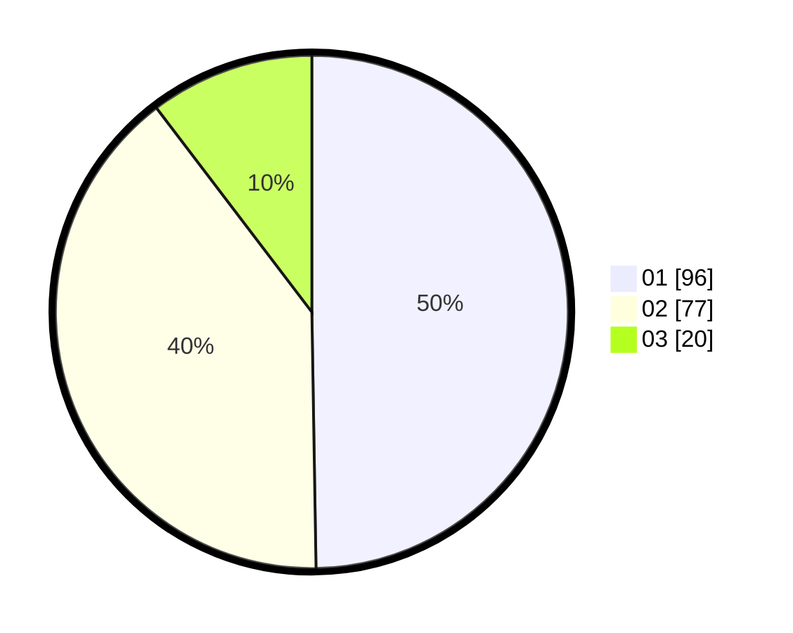

# Hasil

Hasil perolehan suara paslon dapat dilihat pada file paslon-01.txt, paslon-02.txt, dan paslon-03.txt.

Jika tidak ada, artinya data tersebut belum ada pada SIREKAP.

## Perolehan Suara

 * Paslon 01: **96**.
 * Paslon 02: **77**.
 * Paslon 03: **20**.

## Foto C Plano

https://sirekap-obj-formc.kpu.go.id/c091/pemilu/ppwp/31/73/01/10/02/3173011002175-20240214-224704--01ff5e21-f2f6-4f04-a47d-28d4bf13e0bc.jpg

https://sirekap-obj-formc.kpu.go.id/c091/pemilu/ppwp/31/73/01/10/02/3173011002175-20240214-155455--0df8fbcc-d0da-4ba5-9012-79f1361e59ab.jpg

https://sirekap-obj-formc.kpu.go.id/c091/pemilu/ppwp/31/73/01/10/02/3173011002175-20240214-155150--91bb17da-53a2-4c69-9ab7-40625114ab9e.jpg

## DATA PEMILIH TETAP

Jumlah pemilih dalam DPT: **262**.
 * L: **125**.
 * P: **137**.

## DATA PENGGUNA HAK PILIH

Jumlah pengguna hak pilih dalam DPT: **194**.
 * L: **92**.
 * P: **102**.

Jumlah pengguna hak pilih dalam DPTb: **0**.
 * L: **0**.
 * P: **0**.

Jumlah pengguna hak pilih dalam DPK: **1**.
 * L: **0**.
 * P: **1**.

Jumlah pengguna hak pilih: **195**.
 * L: **92**.
 * P: **103**.

## JUMLAH SUARA SAH DAN TIDAK SAH

JUMLAH SELURUH SUARA SAH: **193**.

JUMLAH SUARA TIDAK SAH: **2**.

JUMLAH SELURUH SUARA SAH DAN SUARA TIDAK SAH: **195**.
