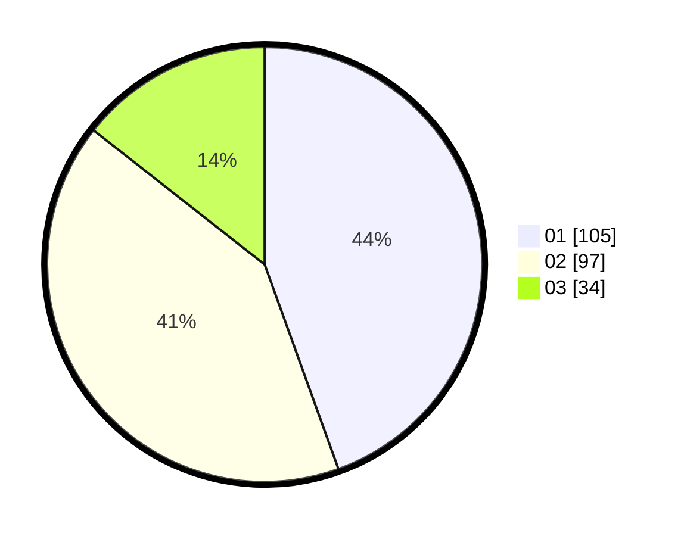

# Hasil

Hasil perolehan suara paslon dapat dilihat pada file paslon-01.txt, paslon-02.txt, dan paslon-03.txt.

Jika tidak ada, artinya data tersebut belum ada pada SIREKAP.

## Perolehan Suara

 * Paslon 01: **105**.
 * Paslon 02: **97**.
 * Paslon 03: **34**.

## Foto C Plano

https://sirekap-obj-formc.kpu.go.id/17f6/pemilu/ppwp/31/73/01/10/02/3173011002176-20240214-184547--ecddebbf-1529-4654-99eb-cff83ddc0e78.jpg

https://sirekap-obj-formc.kpu.go.id/17f6/pemilu/ppwp/31/73/01/10/02/3173011002176-20240215-000317--2685da91-ec8e-4abc-bbdd-e6ecba483dad.jpg

https://sirekap-obj-formc.kpu.go.id/17f6/pemilu/ppwp/31/73/01/10/02/3173011002176-20240214-220129--7da12d96-0125-4717-b589-844d6efa12f2.jpg

## DATA PEMILIH TETAP

Jumlah pemilih dalam DPT: **275**.
 * L: **146**.
 * P: **129**.

## DATA PENGGUNA HAK PILIH

Jumlah pengguna hak pilih dalam DPT: **223**.
 * L: **99**.
 * P: **124**.

Jumlah pengguna hak pilih dalam DPTb: **11**.
 * L: **4**.
 * P: **7**.

Jumlah pengguna hak pilih dalam DPK: **3**.
 * L: **2**.
 * P: **1**.

Jumlah pengguna hak pilih: **237**.
 * L: **105**.
 * P: **132**.

## JUMLAH SUARA SAH DAN TIDAK SAH

JUMLAH SELURUH SUARA SAH: **236**.

JUMLAH SUARA TIDAK SAH: **1**.

JUMLAH SELURUH SUARA SAH DAN SUARA TIDAK SAH: **237**.
