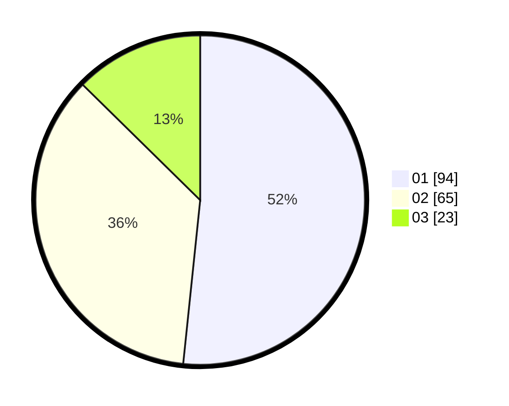

# Hasil

Hasil perolehan suara paslon dapat dilihat pada file paslon-01.txt, paslon-02.txt, dan paslon-03.txt.

Jika tidak ada, artinya data tersebut belum ada pada SIREKAP.

## Perolehan Suara

 * Paslon 01: **94**.
 * Paslon 02: **65**.
 * Paslon 03: **23**.

## Foto C Plano

https://sirekap-obj-formc.kpu.go.id/8f2e/pemilu/ppwp/31/73/01/10/02/3173011002179-20240215-003337--2b1673db-94f7-488c-b49c-dd81c598f384.jpg

https://sirekap-obj-formc.kpu.go.id/8f2e/pemilu/ppwp/31/73/01/10/02/3173011002179-20240215-003536--64a00211-9a0b-4c92-9754-a112b62178a7.jpg

https://sirekap-obj-formc.kpu.go.id/8f2e/pemilu/ppwp/31/73/01/10/02/3173011002179-20240214-201740--11c6a635-5d34-4a2c-8193-9c2ac44824c0.jpg
