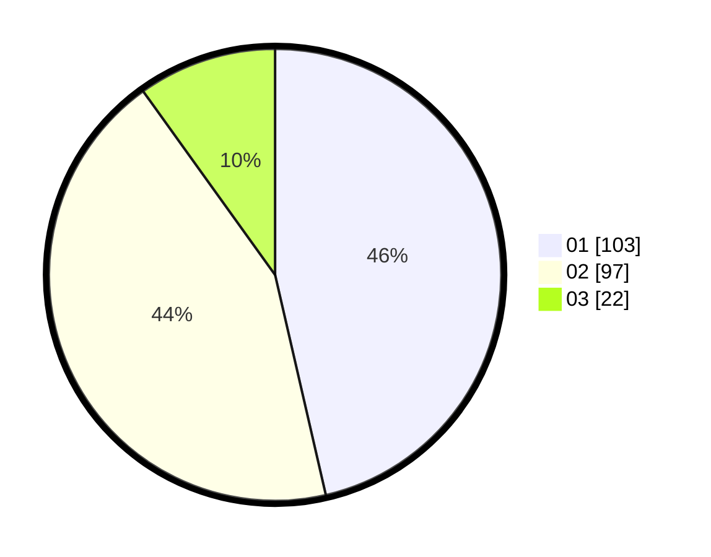

# Hasil

Hasil perolehan suara paslon dapat dilihat pada file paslon-01.txt, paslon-02.txt, dan paslon-03.txt.

Jika tidak ada, artinya data tersebut belum ada pada SIREKAP.

## Perolehan Suara

 * Paslon 01: **103**.
 * Paslon 02: **97**.
 * Paslon 03: **22**.

## Foto C Plano

https://sirekap-obj-formc.kpu.go.id/6ed0/pemilu/ppwp/31/73/01/10/02/3173011002183-20240214-221940--fb5af870-91d4-4b48-9972-a421aa4a0e93.jpg

https://sirekap-obj-formc.kpu.go.id/6ed0/pemilu/ppwp/31/73/01/10/02/3173011002183-20240214-222014--4b06628f-d4fb-49c4-ac22-e57d4ae235ad.jpg

https://sirekap-obj-formc.kpu.go.id/6ed0/pemilu/ppwp/31/73/01/10/02/3173011002183-20240214-222101--3b2c403a-3b13-4547-9db9-04869fe25263.jpg

## DATA PEMILIH TETAP

Jumlah pemilih dalam DPT: **273**.
 * L: **137**.
 * P: **136**.

## DATA PENGGUNA HAK PILIH

Jumlah pengguna hak pilih dalam DPT: **214**.
 * L: **102**.
 * P: **112**.

Jumlah pengguna hak pilih dalam DPTb: **4**.
 * L: **0**.
 * P: **4**.

Jumlah pengguna hak pilih dalam DPK: **6**.
 * L: **5**.
 * P: **1**.

Jumlah pengguna hak pilih: **224**.
 * L: **107**.
 * P: **117**.

## JUMLAH SUARA SAH DAN TIDAK SAH

JUMLAH SELURUH SUARA SAH: **222**.

JUMLAH SUARA TIDAK SAH: **2**.

JUMLAH SELURUH SUARA SAH DAN SUARA TIDAK SAH: **224**.
