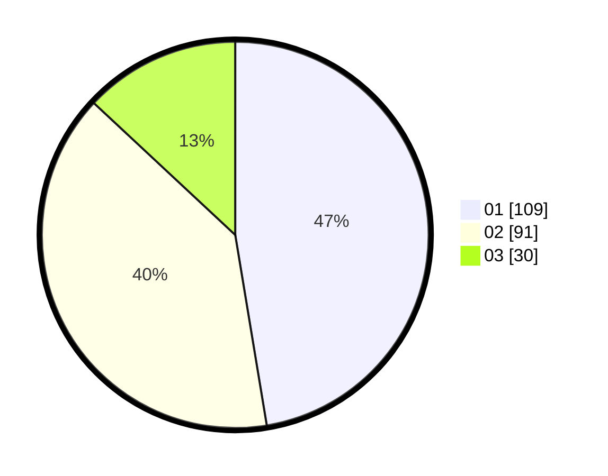

# Hasil

Hasil perolehan suara paslon dapat dilihat pada file paslon-01.txt, paslon-02.txt, dan paslon-03.txt.

Jika tidak ada, artinya data tersebut belum ada pada SIREKAP.

## Perolehan Suara

 * Paslon 01: **109**.
 * Paslon 02: **91**.
 * Paslon 03: **30**.

## Foto C Plano

https://sirekap-obj-formc.kpu.go.id/182b/pemilu/ppwp/31/73/01/10/02/3173011002188-20240214-204550--a7452e52-2a61-4f3d-8d39-28bb4b297bc7.jpg

https://sirekap-obj-formc.kpu.go.id/182b/pemilu/ppwp/31/73/01/10/02/3173011002188-20240214-200119--eb018148-a89f-439d-8d8d-865ee410211c.jpg

https://sirekap-obj-formc.kpu.go.id/182b/pemilu/ppwp/31/73/01/10/02/3173011002188-20240214-200235--4a5dc47a-a9c0-4dbf-afe2-6a932bafa875.jpg

## DATA PEMILIH TETAP

Jumlah pemilih dalam DPT: **277**.
 * L: **140**.
 * P: **137**.

## DATA PENGGUNA HAK PILIH

Jumlah pengguna hak pilih dalam DPT: **232**.
 * L: **111**.
 * P: **121**.

Jumlah pengguna hak pilih dalam DPTb: **0**.
 * L: **0**.
 * P: **0**.

Jumlah pengguna hak pilih dalam DPK: **0**.
 * L: **0**.
 * P: **0**.

Jumlah pengguna hak pilih: **232**.
 * L: **111**.
 * P: **121**.

## JUMLAH SUARA SAH DAN TIDAK SAH

JUMLAH SELURUH SUARA SAH: **230**.

JUMLAH SUARA TIDAK SAH: **2**.

JUMLAH SELURUH SUARA SAH DAN SUARA TIDAK SAH: **232**.
