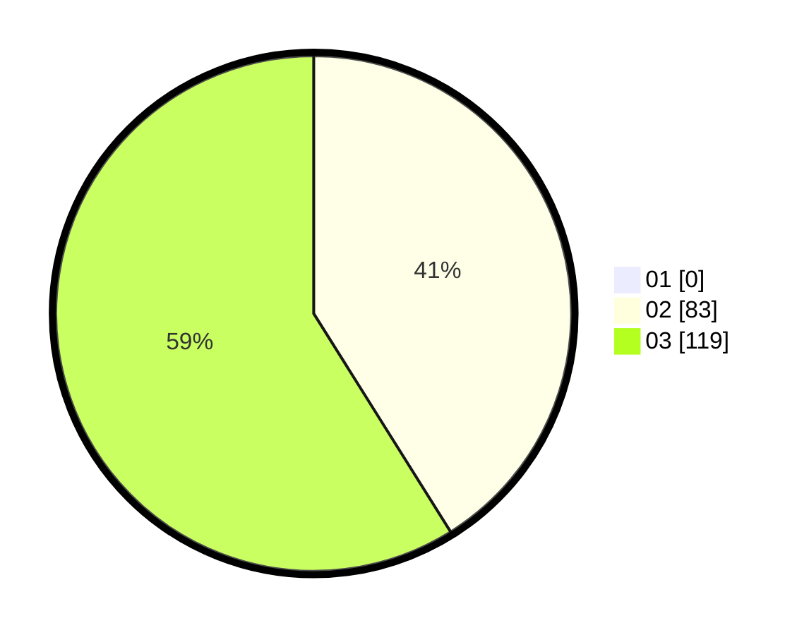

# Hasil

Hasil perolehan suara paslon dapat dilihat pada file paslon-01.txt, paslon-02.txt, dan paslon-03.txt.

Jika tidak ada, artinya data tersebut belum ada pada SIREKAP.

## Perolehan Suara

 * Paslon 01: **0**.
 * Paslon 02: **83**.
 * Paslon 03: **119**.

## Foto C Plano

https://sirekap-obj-formc.kpu.go.id/989d/pemilu/ppwp/31/73/01/10/02/3173011002190-20240214-233616--25b801d7-a7c0-4311-82ae-45ce069d1d81.jpg

https://sirekap-obj-formc.kpu.go.id/989d/pemilu/ppwp/31/73/01/10/02/3173011002190-20240214-233621--146c6780-2e2e-4ead-a3a5-91886e4c34b5.jpg

https://sirekap-obj-formc.kpu.go.id/989d/pemilu/ppwp/31/73/01/10/02/3173011002190-20240214-233625--04fa0e65-8388-4676-b036-a8e4fc7c6e52.jpg
