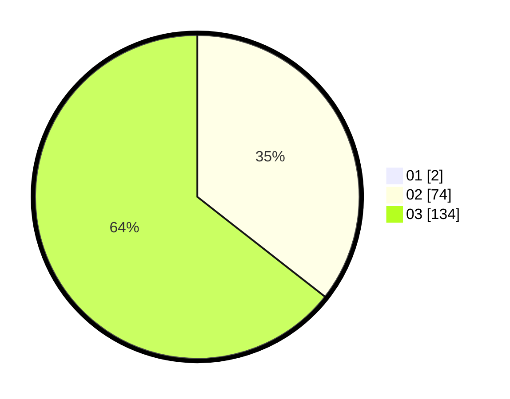

# Hasil

Hasil perolehan suara paslon dapat dilihat pada file paslon-01.txt, paslon-02.txt, dan paslon-03.txt.

Jika tidak ada, artinya data tersebut belum ada pada SIREKAP.

## Perolehan Suara

 * Paslon 01: **2**.
 * Paslon 02: **74**.
 * Paslon 03: **134**.

## Foto C Plano

https://sirekap-obj-formc.kpu.go.id/7946/pemilu/ppwp/31/73/01/10/02/3173011002195-20240214-210908--65d5a340-f6a1-44e5-93c1-f0150c7bab87.jpg

https://sirekap-obj-formc.kpu.go.id/7946/pemilu/ppwp/31/73/01/10/02/3173011002195-20240214-210941--8b553cf1-0044-415f-958a-eae02e6a1671.jpg

https://sirekap-obj-formc.kpu.go.id/7946/pemilu/ppwp/31/73/01/10/02/3173011002195-20240214-210959--25c9194a-0b24-4f8a-bf72-15c8665cd903.jpg
