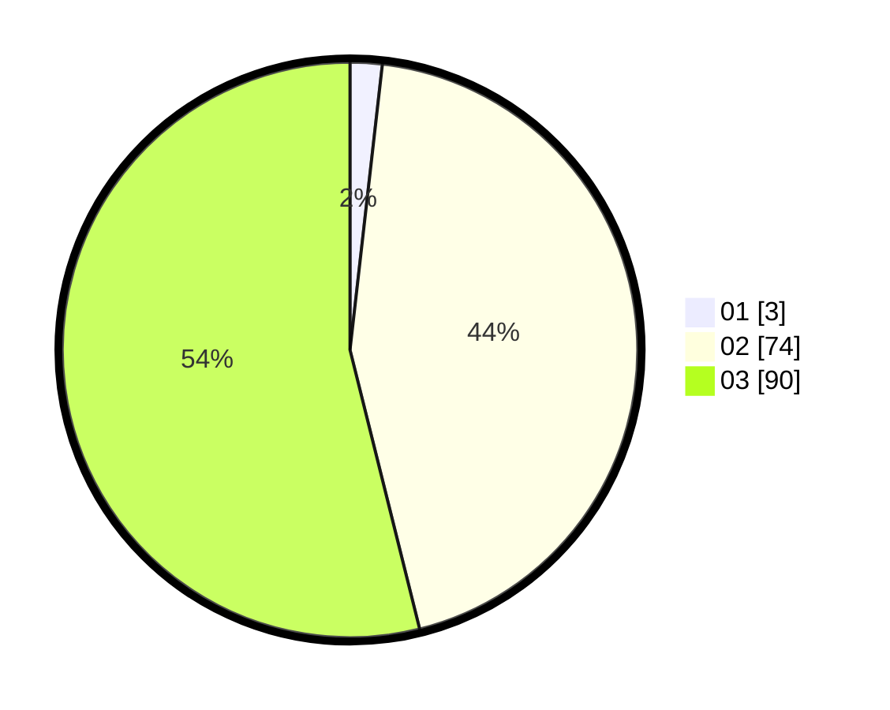

# Hasil

Hasil perolehan suara paslon dapat dilihat pada file paslon-01.txt, paslon-02.txt, dan paslon-03.txt.

Jika tidak ada, artinya data tersebut belum ada pada SIREKAP.

## Perolehan Suara

 * Paslon 01: **3**.
 * Paslon 02: **74**.
 * Paslon 03: **90**.

## Foto C Plano

https://sirekap-obj-formc.kpu.go.id/7d16/pemilu/ppwp/31/73/01/10/02/3173011002197-20240215-214024--02164178-de7f-4caa-ac1d-0d84ec8ed9af.jpg

https://sirekap-obj-formc.kpu.go.id/7d16/pemilu/ppwp/31/73/01/10/02/3173011002197-20240215-214025--1d7a33a4-43ec-42aa-8086-19839133d717.jpg

https://sirekap-obj-formc.kpu.go.id/7d16/pemilu/ppwp/31/73/01/10/02/3173011002197-20240215-214025--e06a715f-1f2f-498d-9a1b-7646216cc4d2.jpg

## DATA PEMILIH TETAP

Jumlah pemilih dalam DPT: **209**.
 * L: **92**.
 * P: **117**.

## DATA PENGGUNA HAK PILIH

Jumlah pengguna hak pilih dalam DPT: **157**.
 * L: **71**.
 * P: **86**.

Jumlah pengguna hak pilih dalam DPTb: **12**.
 * L: **7**.
 * P: **5**.

Jumlah pengguna hak pilih dalam DPK: **1**.
 * L: **0**.
 * P: **1**.

Jumlah pengguna hak pilih: **170**.
 * L: **78**.
 * P: **92**.

## JUMLAH SUARA SAH DAN TIDAK SAH

JUMLAH SELURUH SUARA SAH: **167**.

JUMLAH SUARA TIDAK SAH: **3**.

JUMLAH SELURUH SUARA SAH DAN SUARA TIDAK SAH: **170**.
