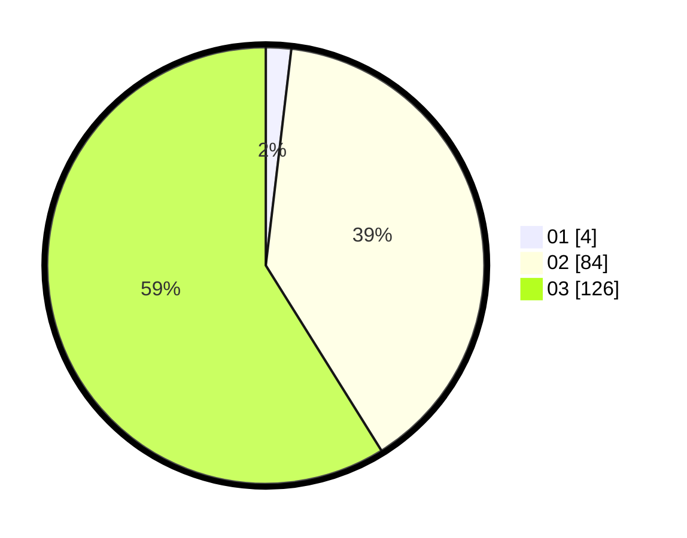

# Hasil

Hasil perolehan suara paslon dapat dilihat pada file paslon-01.txt, paslon-02.txt, dan paslon-03.txt.

Jika tidak ada, artinya data tersebut belum ada pada SIREKAP.

## Perolehan Suara

 * Paslon 01: **4**.
 * Paslon 02: **84**.
 * Paslon 03: **126**.

## Foto C Plano

https://sirekap-obj-formc.kpu.go.id/eca2/pemilu/ppwp/31/73/01/10/02/3173011002199-20240214-155148--d13d0184-a240-41f4-bc38-12f7db0acf2c.jpg

https://sirekap-obj-formc.kpu.go.id/eca2/pemilu/ppwp/31/73/01/10/02/3173011002199-20240214-155204--d541d363-7fa0-4a85-8b6b-f897bee1ac80.jpg

https://sirekap-obj-formc.kpu.go.id/eca2/pemilu/ppwp/31/73/01/10/02/3173011002199-20240214-155218--fc07d1c6-2481-4063-be54-3045c94071c5.jpg

## DATA PEMILIH TETAP

Jumlah pemilih dalam DPT: **243**.
 * L: **120**.
 * P: **123**.

## DATA PENGGUNA HAK PILIH

Jumlah pengguna hak pilih dalam DPT: **206**.
 * L: **98**.
 * P: **108**.

Jumlah pengguna hak pilih dalam DPTb: **10**.
 * L: **4**.
 * P: **6**.

Jumlah pengguna hak pilih dalam DPK: **4**.
 * L: **2**.
 * P: **2**.

Jumlah pengguna hak pilih: **220**.
 * L: **104**.
 * P: **116**.

## JUMLAH SUARA SAH DAN TIDAK SAH

JUMLAH SELURUH SUARA SAH: **214**.

JUMLAH SUARA TIDAK SAH: **6**.

JUMLAH SELURUH SUARA SAH DAN SUARA TIDAK SAH: **220**.
