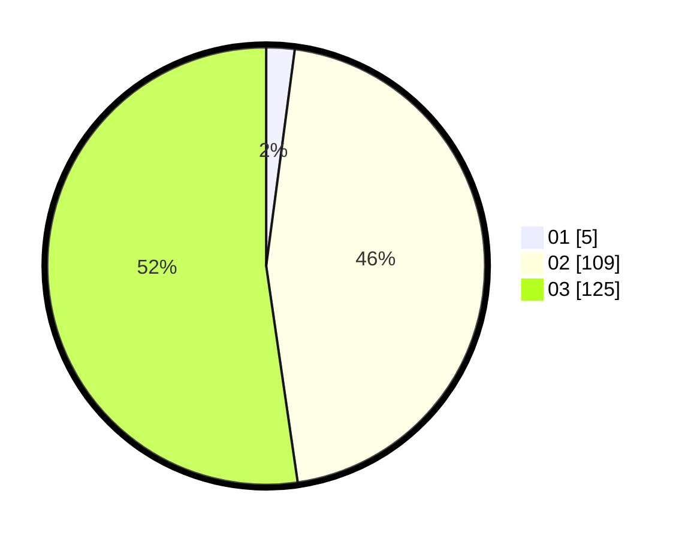

# Hasil

Hasil perolehan suara paslon dapat dilihat pada file paslon-01.txt, paslon-02.txt, dan paslon-03.txt.

Jika tidak ada, artinya data tersebut belum ada pada SIREKAP.

## Perolehan Suara

 * Paslon 01: **5**.
 * Paslon 02: **109**.
 * Paslon 03: **125**.

## Foto C Plano

https://sirekap-obj-formc.kpu.go.id/a41d/pemilu/ppwp/31/73/01/10/02/3173011002200-20240214-155839--3cc8902d-8522-4fcc-a7fd-580e41b6e36b.jpg

https://sirekap-obj-formc.kpu.go.id/a41d/pemilu/ppwp/31/73/01/10/02/3173011002200-20240214-160118--e4fa0b81-73c1-4a57-b43b-a4ba9b41ede4.jpg

https://sirekap-obj-formc.kpu.go.id/a41d/pemilu/ppwp/31/73/01/10/02/3173011002200-20240214-160136--f5cc83ef-f237-4874-8124-bbae87486da7.jpg

## DATA PEMILIH TETAP

Jumlah pemilih dalam DPT: **280**.
 * L: **136**.
 * P: **144**.

## DATA PENGGUNA HAK PILIH

Jumlah pengguna hak pilih dalam DPT: **236**.
 * L: **111**.
 * P: **125**.

Jumlah pengguna hak pilih dalam DPTb: **3**.
 * L: **1**.
 * P: **2**.

Jumlah pengguna hak pilih dalam DPK: **1**.
 * L: **0**.
 * P: **1**.

Jumlah pengguna hak pilih: **240**.
 * L: **112**.
 * P: **128**.

## JUMLAH SUARA SAH DAN TIDAK SAH

JUMLAH SELURUH SUARA SAH: **239**.

JUMLAH SUARA TIDAK SAH: **1**.

JUMLAH SELURUH SUARA SAH DAN SUARA TIDAK SAH: **240**.
