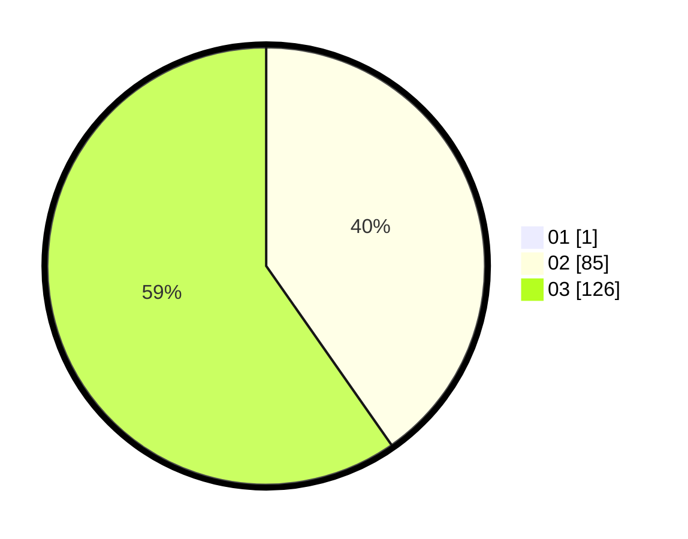

# Hasil

Hasil perolehan suara paslon dapat dilihat pada file paslon-01.txt, paslon-02.txt, dan paslon-03.txt.

Jika tidak ada, artinya data tersebut belum ada pada SIREKAP.

## Perolehan Suara

 * Paslon 01: **1**.
 * Paslon 02: **85**.
 * Paslon 03: **126**.

## Foto C Plano

https://sirekap-obj-formc.kpu.go.id/c154/pemilu/ppwp/31/73/01/10/02/3173011002201-20240214-203938--ec521aea-06c9-4e84-9b76-ea40ed301e55.jpg

https://sirekap-obj-formc.kpu.go.id/c154/pemilu/ppwp/31/73/01/10/02/3173011002201-20240214-212804--1d85d4af-e3c0-4635-b568-26d8d3ccf8b4.jpg

https://sirekap-obj-formc.kpu.go.id/c154/pemilu/ppwp/31/73/01/10/02/3173011002201-20240214-204231--97b16680-8786-40e9-b4dc-c54a10c81d47.jpg
