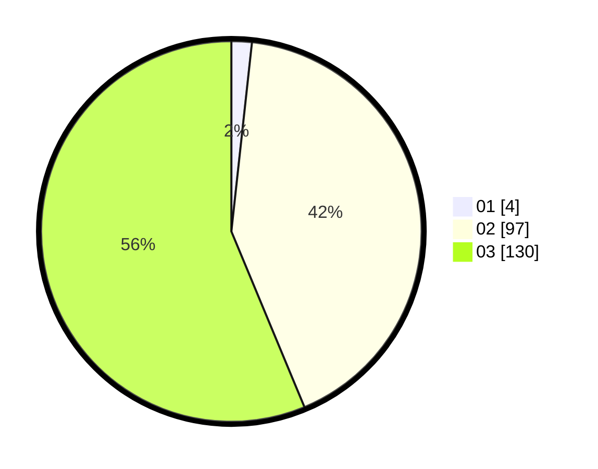

# Hasil

Hasil perolehan suara paslon dapat dilihat pada file paslon-01.txt, paslon-02.txt, dan paslon-03.txt.

Jika tidak ada, artinya data tersebut belum ada pada SIREKAP.

## Perolehan Suara

 * Paslon 01: **4**.
 * Paslon 02: **97**.
 * Paslon 03: **130**.

## Foto C Plano

https://sirekap-obj-formc.kpu.go.id/ec91/pemilu/ppwp/31/73/01/10/02/3173011002202-20240216-012309--5770fb82-75ce-4a97-bdd7-14da4531aae8.jpg

https://sirekap-obj-formc.kpu.go.id/ec91/pemilu/ppwp/31/73/01/10/02/3173011002202-20240216-012311--e6ee737d-2aaa-467c-8eda-48640672a0c1.jpg

https://sirekap-obj-formc.kpu.go.id/ec91/pemilu/ppwp/31/73/01/10/02/3173011002202-20240216-012310--06c6466f-fdac-4f5d-9bb5-813f309198d1.jpg

## DATA PEMILIH TETAP

Jumlah pemilih dalam DPT: **285**.
 * L: **135**.
 * P: **150**.

## DATA PENGGUNA HAK PILIH

Jumlah pengguna hak pilih dalam DPT: **225**.
 * L: **108**.
 * P: **117**.

Jumlah pengguna hak pilih dalam DPTb: **10**.
 * L: **4**.
 * P: **6**.

Jumlah pengguna hak pilih dalam DPK: **4**.
 * L: **3**.
 * P: **1**.

Jumlah pengguna hak pilih: **239**.
 * L: **115**.
 * P: **124**.

## JUMLAH SUARA SAH DAN TIDAK SAH

JUMLAH SELURUH SUARA SAH: **231**.

JUMLAH SUARA TIDAK SAH: **8**.

JUMLAH SELURUH SUARA SAH DAN SUARA TIDAK SAH: **239**.
