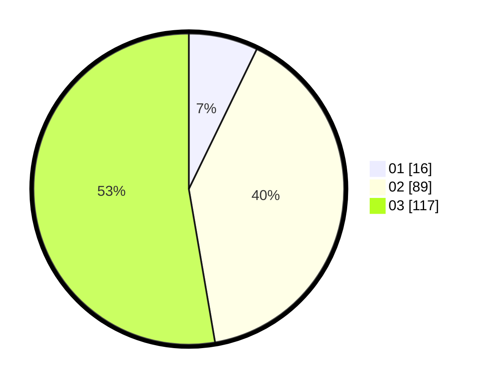

# Hasil

Hasil perolehan suara paslon dapat dilihat pada file paslon-01.txt, paslon-02.txt, dan paslon-03.txt.

Jika tidak ada, artinya data tersebut belum ada pada SIREKAP.

## Perolehan Suara

 * Paslon 01: **16**.
 * Paslon 02: **89**.
 * Paslon 03: **117**.

## Foto C Plano

https://sirekap-obj-formc.kpu.go.id/742c/pemilu/ppwp/31/73/01/10/02/3173011002208-20240215-221013--d7c3a96f-7e8b-42ba-a7af-0cd8fe362e74.jpg

https://sirekap-obj-formc.kpu.go.id/742c/pemilu/ppwp/31/73/01/10/02/3173011002208-20240215-221015--c009c100-94fd-4cc5-80d7-612a7b2a17ec.jpg

https://sirekap-obj-formc.kpu.go.id/742c/pemilu/ppwp/31/73/01/10/02/3173011002208-20240215-221014--9d0c3342-dcd9-4f45-b059-432ad8b5e65f.jpg

## DATA PEMILIH TETAP

Jumlah pemilih dalam DPT: **278**.
 * L: **130**.
 * P: **148**.

## DATA PENGGUNA HAK PILIH

Jumlah pengguna hak pilih dalam DPT: **211**.
 * L: **99**.
 * P: **112**.

Jumlah pengguna hak pilih dalam DPTb: **11**.
 * L: **3**.
 * P: **8**.

Jumlah pengguna hak pilih dalam DPK: **2**.
 * L: **0**.
 * P: **2**.

Jumlah pengguna hak pilih: **224**.
 * L: **102**.
 * P: **122**.

## JUMLAH SUARA SAH DAN TIDAK SAH

JUMLAH SELURUH SUARA SAH: **222**.

JUMLAH SUARA TIDAK SAH: **2**.

JUMLAH SELURUH SUARA SAH DAN SUARA TIDAK SAH: **224**.
