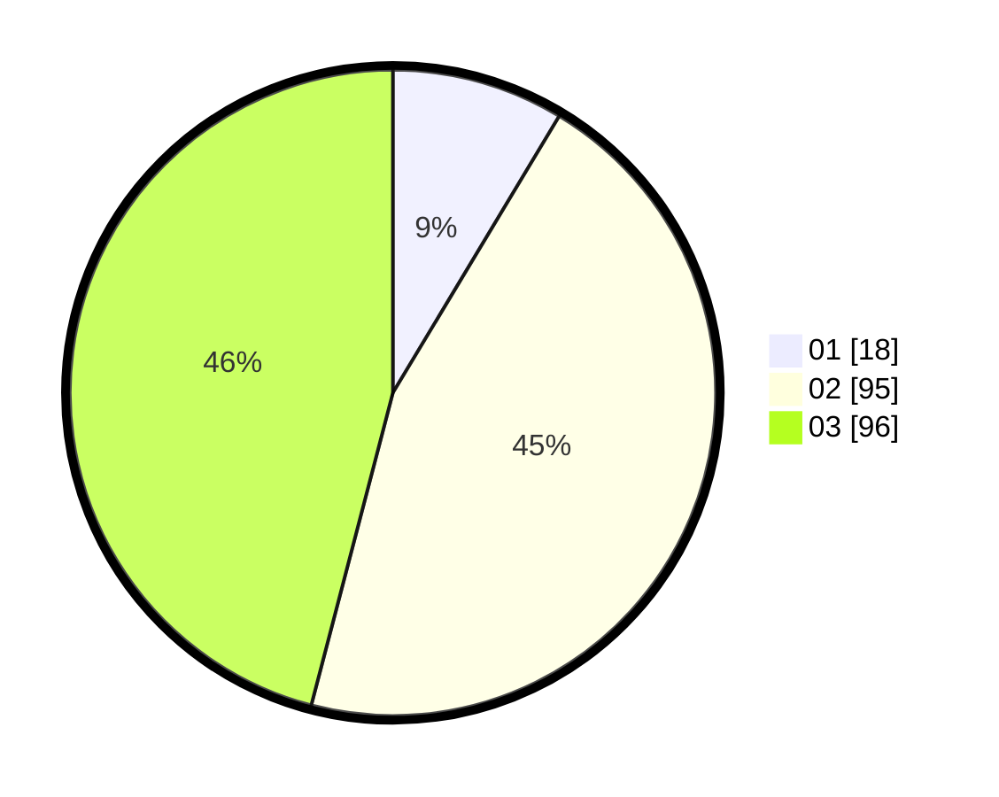

# Hasil

Hasil perolehan suara paslon dapat dilihat pada file paslon-01.txt, paslon-02.txt, dan paslon-03.txt.

Jika tidak ada, artinya data tersebut belum ada pada SIREKAP.

## Perolehan Suara

 * Paslon 01: **18**.
 * Paslon 02: **95**.
 * Paslon 03: **96**.

## Foto C Plano

https://sirekap-obj-formc.kpu.go.id/c7ed/pemilu/ppwp/31/73/01/10/02/3173011002209-20240215-191821--a2445c57-aa65-4ecf-bb5d-60b82eb4c438.jpg

https://sirekap-obj-formc.kpu.go.id/c7ed/pemilu/ppwp/31/73/01/10/02/3173011002209-20240215-191846--f2a7ded3-b69e-4b22-8978-7a63e7bb20f5.jpg

https://sirekap-obj-formc.kpu.go.id/c7ed/pemilu/ppwp/31/73/01/10/02/3173011002209-20240215-191835--ee7091ed-4bcf-4cbf-a99e-03928d20d643.jpg

## DATA PEMILIH TETAP

Jumlah pemilih dalam DPT: **269**.
 * L: **129**.
 * P: **140**.

## DATA PENGGUNA HAK PILIH

Jumlah pengguna hak pilih dalam DPT: **203**.
 * L: **99**.
 * P: **104**.

Jumlah pengguna hak pilih dalam DPTb: **9**.
 * L: **1**.
 * P: **8**.

Jumlah pengguna hak pilih dalam DPK: **0**.
 * L: **0**.
 * P: **0**.

Jumlah pengguna hak pilih: **212**.
 * L: **100**.
 * P: **112**.

## JUMLAH SUARA SAH DAN TIDAK SAH

JUMLAH SELURUH SUARA SAH: **209**.

JUMLAH SUARA TIDAK SAH: **3**.

JUMLAH SELURUH SUARA SAH DAN SUARA TIDAK SAH: **212**.
