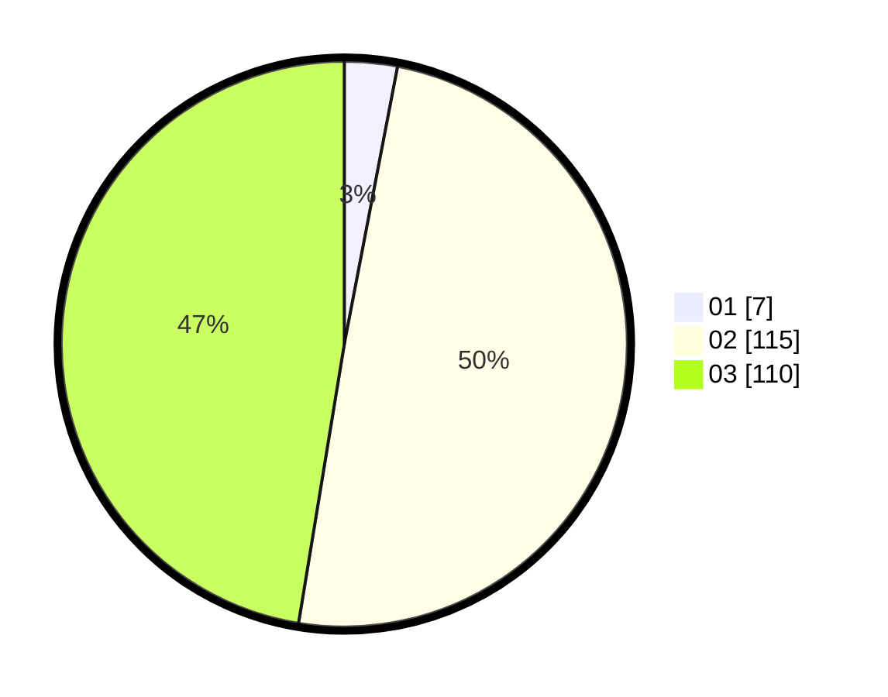

# Hasil

Hasil perolehan suara paslon dapat dilihat pada file paslon-01.txt, paslon-02.txt, dan paslon-03.txt.

Jika tidak ada, artinya data tersebut belum ada pada SIREKAP.

## Perolehan Suara

 * Paslon 01: **7**.
 * Paslon 02: **115**.
 * Paslon 03: **110**.

## Foto C Plano

https://sirekap-obj-formc.kpu.go.id/925b/pemilu/ppwp/31/73/01/10/02/3173011002213-20240216-011508--47bc4c61-532c-468c-b072-56a701e09c64.jpg

https://sirekap-obj-formc.kpu.go.id/925b/pemilu/ppwp/31/73/01/10/02/3173011002213-20240216-011510--c4c86366-42f1-4348-8b21-761a78155704.jpg

https://sirekap-obj-formc.kpu.go.id/925b/pemilu/ppwp/31/73/01/10/02/3173011002213-20240216-011508--49a39609-922c-49b4-8283-df9303e6ab3a.jpg

## DATA PEMILIH TETAP

Jumlah pemilih dalam DPT: **273**.
 * L: **124**.
 * P: **146**.

## DATA PENGGUNA HAK PILIH

Jumlah pengguna hak pilih dalam DPT: **219**.
 * L: **105**.
 * P: **114**.

Jumlah pengguna hak pilih dalam DPTb: **6**.
 * L: **2**.
 * P: **4**.

Jumlah pengguna hak pilih dalam DPK: **7**.
 * L: **4**.
 * P: **3**.

Jumlah pengguna hak pilih: **232**.
 * L: **111**.
 * P: **121**.

## JUMLAH SUARA SAH DAN TIDAK SAH

JUMLAH SELURUH SUARA SAH: **232**.

JUMLAH SUARA TIDAK SAH: **0**.

JUMLAH SELURUH SUARA SAH DAN SUARA TIDAK SAH: **232**.
