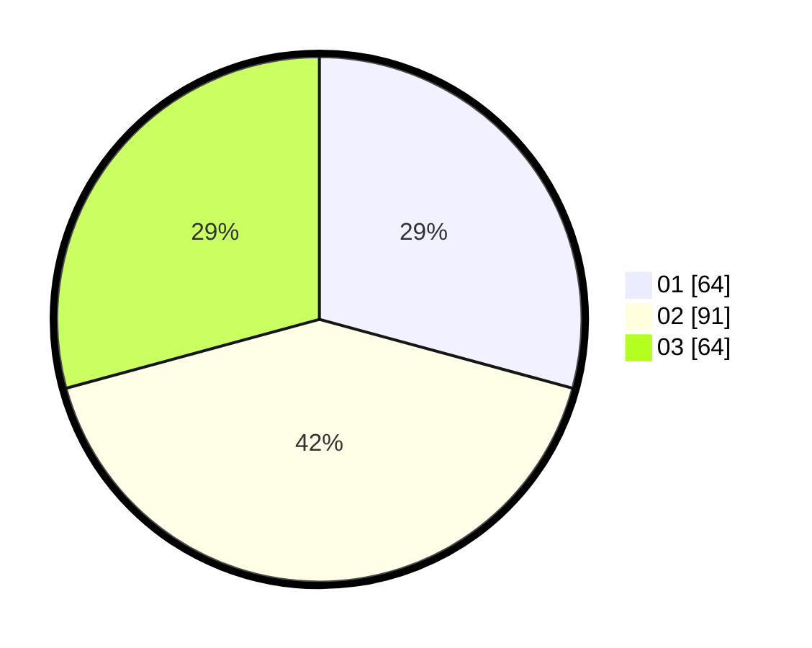

# Hasil

Hasil perolehan suara paslon dapat dilihat pada file paslon-01.txt, paslon-02.txt, dan paslon-03.txt.

Jika tidak ada, artinya data tersebut belum ada pada SIREKAP.

## Perolehan Suara

 * Paslon 01: **64**.
 * Paslon 02: **91**.
 * Paslon 03: **64**.

## Foto C Plano

https://sirekap-obj-formc.kpu.go.id/dece/pemilu/ppwp/31/73/01/10/02/3173011002215-20240216-180913--b541bbbc-1ce1-4152-a837-47168bad8d34.jpg

https://sirekap-obj-formc.kpu.go.id/dece/pemilu/ppwp/31/73/01/10/02/3173011002215-20240216-180914--954f9d44-cbe9-4ded-b79f-1c44fc4af879.jpg

https://sirekap-obj-formc.kpu.go.id/dece/pemilu/ppwp/31/73/01/10/02/3173011002215-20240216-180914--0f7f6c61-13f2-44ca-bb46-a30b812b20e8.jpg

## DATA PEMILIH TETAP

Jumlah pemilih dalam DPT: **277**.
 * L: **133**.
 * P: **144**.

## DATA PENGGUNA HAK PILIH

Jumlah pengguna hak pilih dalam DPT: **226**.
 * L: **109**.
 * P: **117**.

Jumlah pengguna hak pilih dalam DPTb: **0**.
 * L: **0**.
 * P: **0**.

Jumlah pengguna hak pilih dalam DPK: **1**.
 * L: **1**.
 * P: **0**.

Jumlah pengguna hak pilih: **227**.
 * L: **110**.
 * P: **117**.

## JUMLAH SUARA SAH DAN TIDAK SAH

JUMLAH SELURUH SUARA SAH: **219**.

JUMLAH SUARA TIDAK SAH: **8**.

JUMLAH SELURUH SUARA SAH DAN SUARA TIDAK SAH: **227**.
