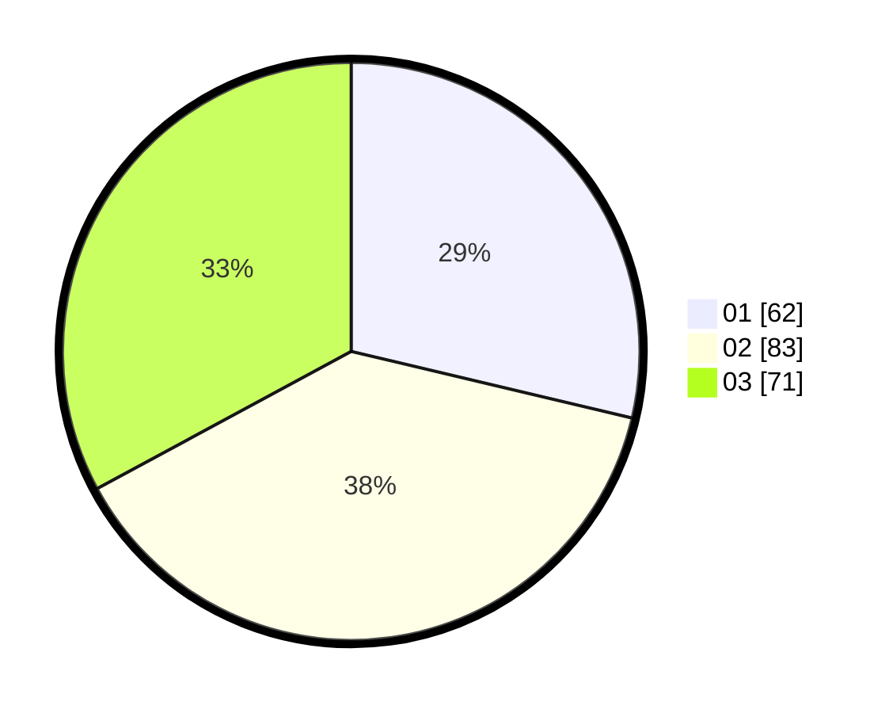

# Hasil

Hasil perolehan suara paslon dapat dilihat pada file paslon-01.txt, paslon-02.txt, dan paslon-03.txt.

Jika tidak ada, artinya data tersebut belum ada pada SIREKAP.

## Perolehan Suara

 * Paslon 01: **62**.
 * Paslon 02: **83**.
 * Paslon 03: **71**.

## Foto C Plano

https://sirekap-obj-formc.kpu.go.id/23a8/pemilu/ppwp/31/73/01/10/02/3173011002216-20240216-180028--89f73a8b-39c8-492f-85b0-0201f82601a1.jpg

https://sirekap-obj-formc.kpu.go.id/23a8/pemilu/ppwp/31/73/01/10/02/3173011002216-20240216-180030--cd0aa7e9-0612-409a-8287-30e4a38942d4.jpg

https://sirekap-obj-formc.kpu.go.id/23a8/pemilu/ppwp/31/73/01/10/02/3173011002216-20240216-180029--716df8f8-4a90-4623-a0fa-20ed85d4350c.jpg

## DATA PEMILIH TETAP

Jumlah pemilih dalam DPT: **278**.
 * L: **134**.
 * P: **144**.

## DATA PENGGUNA HAK PILIH

Jumlah pengguna hak pilih dalam DPT: **218**.
 * L: **103**.
 * P: **115**.

Jumlah pengguna hak pilih dalam DPTb: **0**.
 * L: **0**.
 * P: **0**.

Jumlah pengguna hak pilih dalam DPK: **0**.
 * L: **0**.
 * P: **0**.

Jumlah pengguna hak pilih: **218**.
 * L: **103**.
 * P: **115**.

## JUMLAH SUARA SAH DAN TIDAK SAH

JUMLAH SELURUH SUARA SAH: **216**.

JUMLAH SUARA TIDAK SAH: **2**.

JUMLAH SELURUH SUARA SAH DAN SUARA TIDAK SAH: **218**.
