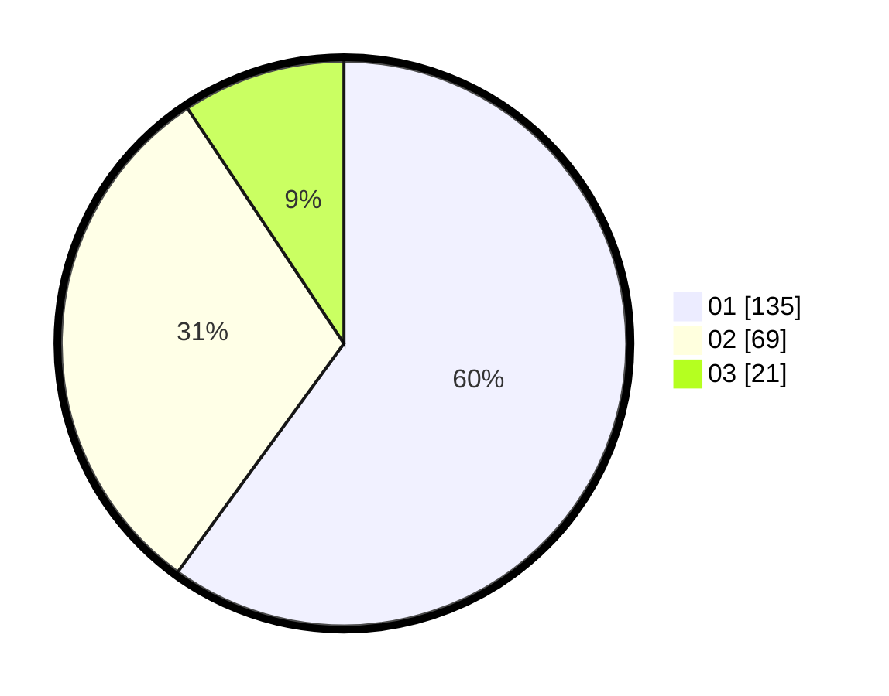

# Hasil

Hasil perolehan suara paslon dapat dilihat pada file paslon-01.txt, paslon-02.txt, dan paslon-03.txt.

Jika tidak ada, artinya data tersebut belum ada pada SIREKAP.

## Perolehan Suara

 * Paslon 01: **135**.
 * Paslon 02: **69**.
 * Paslon 03: **21**.

## Foto C Plano

https://sirekap-obj-formc.kpu.go.id/7db5/pemilu/ppwp/31/73/01/10/02/3173011002218-20240214-192356--a115e262-9b1e-4ff8-834a-4a201924a2b9.jpg

https://sirekap-obj-formc.kpu.go.id/7db5/pemilu/ppwp/31/73/01/10/02/3173011002218-20240215-020932--4de39de9-9f65-4959-a0db-a1995af08ae6.jpg

https://sirekap-obj-formc.kpu.go.id/7db5/pemilu/ppwp/31/73/01/10/02/3173011002218-20240214-192551--8fec92b2-5f3f-431c-bf16-7f05d51b1345.jpg

## DATA PEMILIH TETAP

Jumlah pemilih dalam DPT: **274**.
 * L: **139**.
 * P: **135**.

## DATA PENGGUNA HAK PILIH

Jumlah pengguna hak pilih dalam DPT: **225**.
 * L: **113**.
 * P: **112**.

Jumlah pengguna hak pilih dalam DPTb: **1**.
 * L: **1**.
 * P: **0**.

Jumlah pengguna hak pilih dalam DPK: **1**.
 * L: **0**.
 * P: **1**.

Jumlah pengguna hak pilih: **227**.
 * L: **114**.
 * P: **113**.

## JUMLAH SUARA SAH DAN TIDAK SAH

JUMLAH SELURUH SUARA SAH: **225**.

JUMLAH SUARA TIDAK SAH: **2**.

JUMLAH SELURUH SUARA SAH DAN SUARA TIDAK SAH: **227**.
