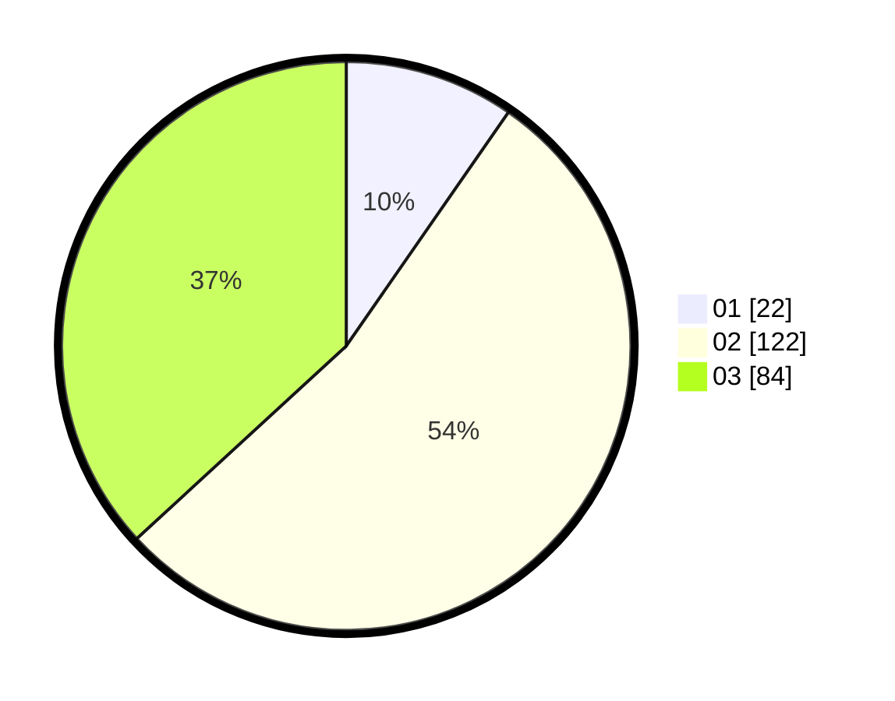

# Hasil

Hasil perolehan suara paslon dapat dilihat pada file paslon-01.txt, paslon-02.txt, dan paslon-03.txt.

Jika tidak ada, artinya data tersebut belum ada pada SIREKAP.

## Perolehan Suara

 * Paslon 01: **22**.
 * Paslon 02: **122**.
 * Paslon 03: **84**.

## Foto C Plano

https://sirekap-obj-formc.kpu.go.id/4721/pemilu/ppwp/31/73/01/10/02/3173011002220-20240214-195627--17b86489-b3ff-4c91-8c05-4d0d0a25d9de.jpg

https://sirekap-obj-formc.kpu.go.id/4721/pemilu/ppwp/31/73/01/10/02/3173011002220-20240214-200302--56c3884c-2209-49d1-9e87-27fbdf809cd5.jpg

https://sirekap-obj-formc.kpu.go.id/4721/pemilu/ppwp/31/73/01/10/02/3173011002220-20240214-195917--030a523c-02a5-4880-a337-73d41e3bfae2.jpg
