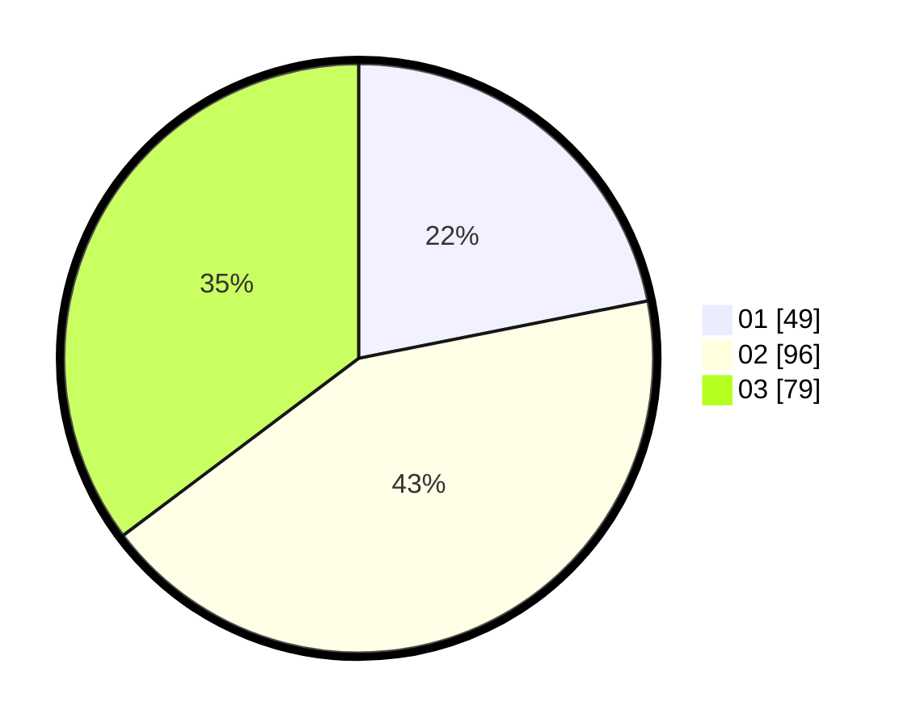

# Hasil

Hasil perolehan suara paslon dapat dilihat pada file paslon-01.txt, paslon-02.txt, dan paslon-03.txt.

Jika tidak ada, artinya data tersebut belum ada pada SIREKAP.

## Perolehan Suara

 * Paslon 01: **49**.
 * Paslon 02: **96**.
 * Paslon 03: **79**.

## Foto C Plano

https://sirekap-obj-formc.kpu.go.id/45bb/pemilu/ppwp/31/73/01/10/02/3173011002223-20240215-004534--b6ffe71a-9774-4638-96d0-9bc013d77dff.jpg

https://sirekap-obj-formc.kpu.go.id/45bb/pemilu/ppwp/31/73/01/10/02/3173011002223-20240215-004924--2c4d7eed-fdc8-45aa-abc7-28240b92c451.jpg

https://sirekap-obj-formc.kpu.go.id/45bb/pemilu/ppwp/31/73/01/10/02/3173011002223-20240215-005220--12dcebc0-2122-40be-b7ed-14dac10366b3.jpg
