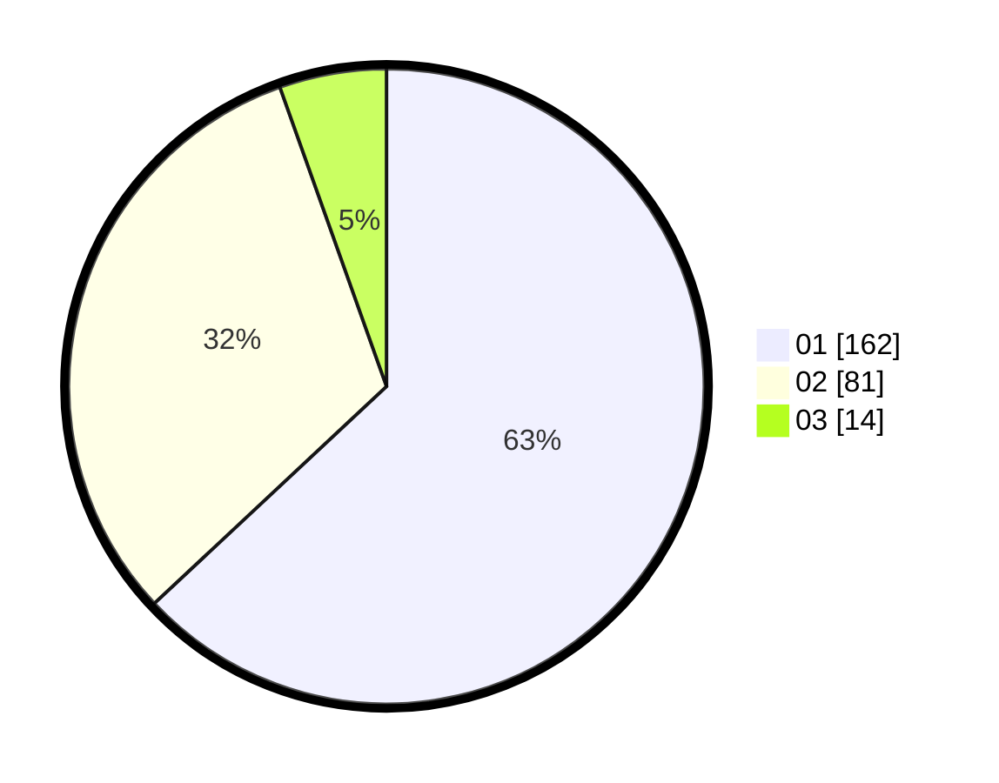

# Hasil

Hasil perolehan suara paslon dapat dilihat pada file paslon-01.txt, paslon-02.txt, dan paslon-03.txt.

Jika tidak ada, artinya data tersebut belum ada pada SIREKAP.

## Perolehan Suara

 * Paslon 01: **162**.
 * Paslon 02: **81**.
 * Paslon 03: **14**.

## Foto C Plano

https://sirekap-obj-formc.kpu.go.id/6571/pemilu/ppwp/31/73/01/10/02/3173011002226-20240216-065214--7f127d84-0b5d-410c-9940-1c272a7c261e.jpg

https://sirekap-obj-formc.kpu.go.id/6571/pemilu/ppwp/31/73/01/10/02/3173011002226-20240216-082616--c84ada57-a4b8-496c-93a0-662d1877009c.jpg

https://sirekap-obj-formc.kpu.go.id/6571/pemilu/ppwp/31/73/01/10/02/3173011002226-20240216-065215--769f9fd7-67bf-490e-803f-a7ee667963e0.jpg

## DATA PEMILIH TETAP

Jumlah pemilih dalam DPT: **296**.
 * L: **152**.
 * P: **144**.

## DATA PENGGUNA HAK PILIH

Jumlah pengguna hak pilih dalam DPT: **254**.
 * L: **128**.
 * P: **126**.

Jumlah pengguna hak pilih dalam DPTb: **3**.
 * L: **2**.
 * P: **1**.

Jumlah pengguna hak pilih dalam DPK: **2**.
 * L: **1**.
 * P: **1**.

Jumlah pengguna hak pilih: **259**.
 * L: **131**.
 * P: **128**.

## JUMLAH SUARA SAH DAN TIDAK SAH

JUMLAH SELURUH SUARA SAH: **257**.

JUMLAH SUARA TIDAK SAH: **2**.

JUMLAH SELURUH SUARA SAH DAN SUARA TIDAK SAH: **259**.
