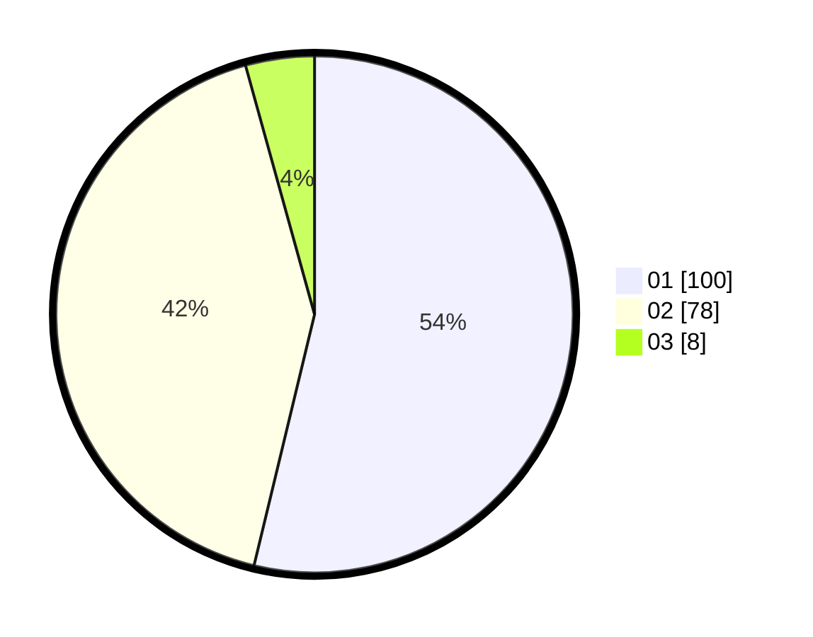

# Hasil

Hasil perolehan suara paslon dapat dilihat pada file paslon-01.txt, paslon-02.txt, dan paslon-03.txt.

Jika tidak ada, artinya data tersebut belum ada pada SIREKAP.

## Perolehan Suara

 * Paslon 01: **100**.
 * Paslon 02: **78**.
 * Paslon 03: **8**.

## Foto C Plano

https://sirekap-obj-formc.kpu.go.id/8ad4/pemilu/ppwp/31/73/01/10/02/3173011002227-20240215-134830--cb54c824-523f-4ce2-9c16-3b572bb14fcd.jpg

https://sirekap-obj-formc.kpu.go.id/8ad4/pemilu/ppwp/31/73/01/10/02/3173011002227-20240215-135741--0a0e93a7-a1b4-4dd6-aba9-1174b9b116ae.jpg

https://sirekap-obj-formc.kpu.go.id/8ad4/pemilu/ppwp/31/73/01/10/02/3173011002227-20240215-135943--4feb2fe3-109b-42d4-a5da-2b9c9c9c9248.jpg

## DATA PEMILIH TETAP

Jumlah pemilih dalam DPT: **242**.
 * L: **115**.
 * P: **127**.

## DATA PENGGUNA HAK PILIH

Jumlah pengguna hak pilih dalam DPT: **188**.
 * L: **90**.
 * P: **98**.

Jumlah pengguna hak pilih dalam DPTb: **0**.
 * L: **0**.
 * P: **0**.

Jumlah pengguna hak pilih dalam DPK: **0**.
 * L: **0**.
 * P: **0**.

Jumlah pengguna hak pilih: **188**.
 * L: **90**.
 * P: **98**.

## JUMLAH SUARA SAH DAN TIDAK SAH

JUMLAH SELURUH SUARA SAH: **186**.

JUMLAH SUARA TIDAK SAH: **2**.

JUMLAH SELURUH SUARA SAH DAN SUARA TIDAK SAH: **188**.
