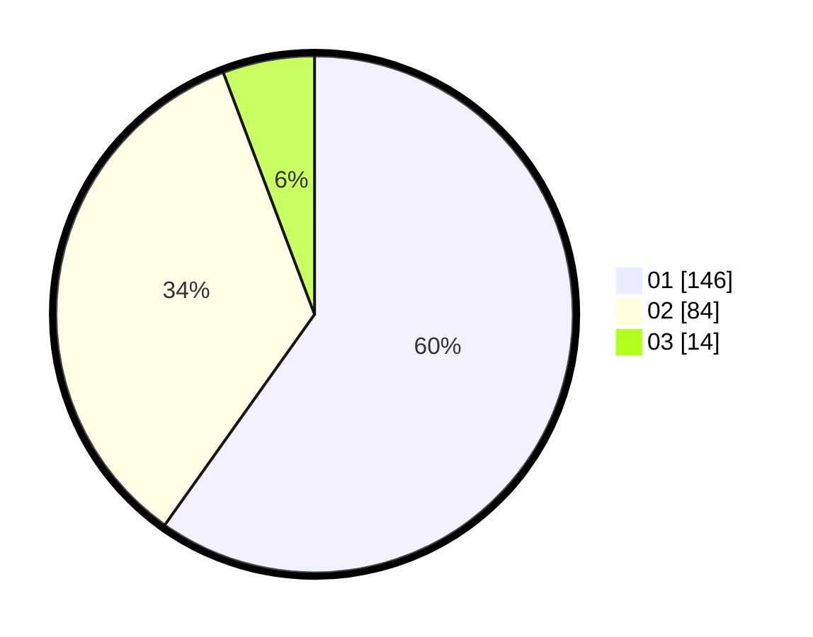

# Hasil

Hasil perolehan suara paslon dapat dilihat pada file paslon-01.txt, paslon-02.txt, dan paslon-03.txt.

Jika tidak ada, artinya data tersebut belum ada pada SIREKAP.

## Perolehan Suara

 * Paslon 01: **146**.
 * Paslon 02: **84**.
 * Paslon 03: **14**.

## Foto C Plano

https://sirekap-obj-formc.kpu.go.id/0f28/pemilu/ppwp/31/73/01/10/02/3173011002229-20240214-160126--0a860c27-3281-43d8-be0b-8fbedd25e0cb.jpg

https://sirekap-obj-formc.kpu.go.id/0f28/pemilu/ppwp/31/73/01/10/02/3173011002229-20240214-155908--c64d3dae-e402-41dd-93df-668083b30d5f.jpg

https://sirekap-obj-formc.kpu.go.id/0f28/pemilu/ppwp/31/73/01/10/02/3173011002229-20240214-160119--fa3e67eb-7569-4f47-9d8b-20f8987c628f.jpg

## DATA PEMILIH TETAP

Jumlah pemilih dalam DPT: **280**.
 * L: **136**.
 * P: **144**.

## DATA PENGGUNA HAK PILIH

Jumlah pengguna hak pilih dalam DPT: **244**.
 * L: **118**.
 * P: **126**.

Jumlah pengguna hak pilih dalam DPTb: **7**.
 * L: **2**.
 * P: **5**.

Jumlah pengguna hak pilih dalam DPK: **0**.
 * L: **0**.
 * P: **0**.

Jumlah pengguna hak pilih: **251**.
 * L: **120**.
 * P: **131**.

## JUMLAH SUARA SAH DAN TIDAK SAH

JUMLAH SELURUH SUARA SAH: **244**.

JUMLAH SUARA TIDAK SAH: **7**.

JUMLAH SELURUH SUARA SAH DAN SUARA TIDAK SAH: **251**.
